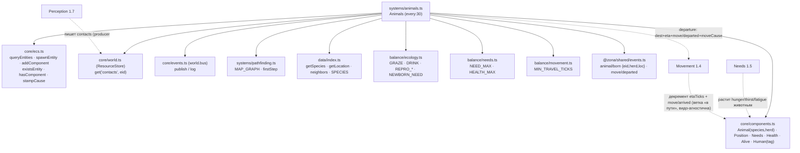

# Animals (1.9) — стада, пастьба/бегство, ПРИЧИННОЕ размножение

Система Animals оживляет стада: пасёт/поит стоящих (компенсирует накопление Needs),
гонит пугливых от людей, стягивает отставших к стаду и на детерминированных
«племенных тиках» даёт приплод ПО ПОРОГАМ СОСТОЯНИЯ мира (не «X% приплод»).

## Граф зависимостей



## Ключевые инварианты

- **Закон №1 (живёт без игрока):** пастьба/питьё компенсируют накопление Needs, а
  приплод/гибель идут из состояния мира. За 100 дней без людей стадо в кормном
  угодье не вымирает и не взрывается (reproCap — потолок).
- **Закон №2 (причинность, НЕ «X% приплод»):** рождение = ДЕТЕРМИНИРОВАННАЯ
  периодичность («племенной тик») × ПОРОГИ СОСТОЯНИЯ. Никакого rng на факт рождения
  (rng в системе не используется вовсе). «Племенной тик» стада:
  `tick >= phase(herd) && (tick - phase(herd)) % gestationTicks(species) === 0`, где
  `phase(herd)` — фиксированный хеш id стада, КРАТНЫЙ шагу `every` и `< gestation`.
- **Пороги рождения (состояние мира):** локальная популяция вида в мажоритарной
  локации стада `< reproCap`; `loc.forage > REPRO_FORAGE_MIN`; в локации
  `>= REPRO_MIN_HERD_IN_LOC` особей стада (родители ФИЗИЧЕСКИ существуют, закон №3).
  Не выполнены → нет рождения В ЭТОТ цикл (НЕ откладывается в таймер). Максимум ОДНО
  рождение на стадо за племенной тик.
- **Закон №3 (ничего из воздуха):** новорождённый — `spawnEntity` + полный набор
  компонентов, рождён стадом; корм/вода пастьбы — из СРЕДЫ локации.
- **Закон №8 + RESUME (P0):** размножение STATELESS — БЕЗ хранимого таймера. Всё
  выводится из `tick` + id стада (`phase`) + переписи ЖИВЫХ животных (восстанавливается
  тождественно). Непрерывный прогон ≡ split save/load по популяции И логу `animal/born`
  (доказано хэшем; без дубля/пропуска рождения на границе load). `gestationTicks`
  кратен шагу `every` — guard-канарейка при загрузке модуля (как Weather cadence).
- **Движение животных (без Task, без дублирования Movement):** у животных НЕТ
  `Task` (это артефакт utility-AI людей, D-033). Animals САМ делает «departure»
  стоящему животному (бегство/стадность): `Position.dest = шаг`, `etaTicks = edgeLen`,
  `move/departed` (causedBy: null — экологический драйв корень), штамп id в
  `Position.moveCause`. Декремент/прибытие (`move/arrived`, causedBy = moveCause) —
  видо-агностичная ветка «в пути» Movement (`every:1`). Пока в пути — Animals не
  трогает животное. Порядок в прогоне: Perception < Animals (contacts producer<consumer).
- **Бегство (D-029):** пугливый (`flees=true`, олень) с ЖИВЫМ человеком в `contacts`
  (валидируем `existsEntity` — контакт мог держать мёртвый eid ≤1 тик — И `Human`) →
  departure в соседа с min `danger` (tie — min id). Непугливый (кабан) не бежит.

## Пример

```ts
import { Animals } from '@zona/sim/systems/animals';
import { Needs } from '@zona/sim/systems/needs';
import { Movement } from '@zona/sim/systems/movement';
import { Perception } from '@zona/sim/systems/perception';

sched.register(Perception); // пишет contacts (до Animals)
sched.register(Needs);      // растит нужды животным
sched.register(Animals);    // пастьба/бегство/стадность/приплод
sched.register(Movement);   // довозит животных по dest (ветка «в пути»)
```
