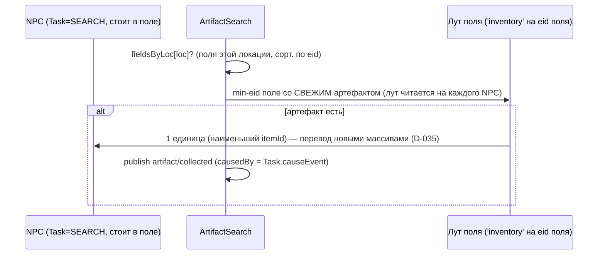

# SEARCH (2.10, D-057) — поход за артефактом (выбор) + сбор (исполнение)

Задача 2.10 замыкает SEAM D-054: NPC ЗАБИРАЕТ артефакт, рождённый аномальным полем
(ArtifactSpawn 2.9), **переводом** записи из наземного лута поля (`'inventory'` на eid
поля, D-046) в свой инвентарь. Две части:

- **Выбор SEARCH** — `systems/task-selection.ts` (utility-AI): NPC решает идти к полю с
  артефактом, из СОСТОЯНИЯ мира (достижимое поле с лутом + спокойствие), не по скрипту.
- **Сбор** — новая изолированная `systems/artifact-search.ts` (аналог Trade): стоящий в
  поле NPC с `Task.kind === SEARCH` подбирает артефакт. Это **ПЕРЕВОД** (закон №3): масса
  сохраняется, леджер НЕ нужен (как торговля D-047), EconomyInvariant держится с дельтой 0.

## Граф зависимостей

```mermaid
graph TD
  TS["systems/task-selection.ts<br/>TaskSelection (every:1)"]
  AS["systems/artifact-search.ts<br/>ArtifactSearch (every:1)"]
  COMP["core/components.ts<br/>Task(kind=SEARCH,causeEvent) · Position · AnomalyField · Human/Alive"]
  RS["core/world.ts (ResourceStore)<br/>'inventory' на eid поля / NPC (D-046)"]
  DATA["data/index.ts<br/>getItem (kind==='artifact')"]
  BAL["balance/utility.ts<br/>W.search=0.7"]
  PATH["systems/pathfinding.ts<br/>nearestLoc (Дейкстра, tie→min id)"]
  ECS["core/ecs.ts<br/>queryEntities · stampCause"]
  BUS["core/events.ts (world.bus)<br/>publish"]
  EV["@zona/shared/events.ts<br/>task/selected · artifact/collected"]

  TS -. читает лут поля .-> RS
  TS --> DATA
  TS --> BAL
  TS --> PATH
  TS --> ECS
  TS --> BUS
  TS -->|"пишет Task=SEARCH,<br/>штампует causeEvent"| COMP

  AS -. читает Task/Position .-> COMP
  AS -->|"перевод лута<br/>поле→NPC (D-035)"| RS
  AS --> DATA
  AS --> ECS
  AS --> BUS
  AS --> EV
  TS --> EV

  COMP -. causedBy = Task.causeEvent NPC .-> AS
```

## Причинная цепочка (закон №2/№6)

```
ArtifactSpawn (2.9): charge≥порог → artifact/spawned + item/harvested(source:anomaly)
                     [артефакт лёг в inventory ПОЛЯ; масса УЖЕ отледжерена]
      │
TaskSelection (2.10): поле с лутом достижимо + спокойствие → Task=SEARCH, task/selected
                     [штамп Task.causeEvent = id task/selected]
      │  (Movement довозит NPC к полю, если он не на месте)
      ▼
ArtifactSearch (2.10): NPC стоит в поле → перевод 1 ед. поле→NPC → artifact/collected
                     [causedBy = Task.causeEvent; масса СОХРАНЕНА, НЕ леджер]
```

- Масса создаётся **в момент рождения** (D-054), поэтому леджерит `item/harvested`
  РОЖДЕНИЕ. Сбор — конс. перевод (`worldTotals` уже вырос при рождении; повторный
  ледж­ер задвоил бы EconomyInvariant). `artifact/collected` игнорируется чекером массы.

## Оценка sSearch (utility-AI, веса — balance/utility.ts, закон №7)

```
sSearch = canSearch ? W.search · safety · max(0, 1 − maxNeed) : −∞
  canSearch = (ближайшее достижимое поле с артефактом ≠ undefined) И (не ночь)
  safety    = 1 − danger(loc)
  maxNeed   = max(hunger, thirst, fatigue, fear)   (нормировано /NEED_MAX)
  W.search  = 0.7   (> W.trade 0.6 > W.work 0.5)
```

- **Причинно** (закон №2, не «X% находки»): `artifactFieldLocs` — локации полей, чей
  `'inventory'` содержит `kind:'artifact'` (qty>0); собраны один раз до цикла NPC, сорт.
  по возрастанию id (закон №8). Пусто/недостижимо ⇒ sSearch=−∞ (исключён из argmax).
- **Гейт как WORK/TRADE**: артефакт — не выживание, любая критическая нужда/страх через
  `needCalm` гасят SEARCH к нулю и пропускают вперёд EAT/DRINK/SLEEP/HUNT/FLEE.
- **Ночью −∞**: вылазка в аномалию по темноте не предпринимается (симметрично WORK/TRADE).
- **Вес 0.7 > trade 0.6**: жадность за дорогим кушем (basePrice 8000+) перебивает рутинную
  торговлю у спокойного NPC (эмерджентный «выход за хабаром» без расписания, закон №1).
- **argmax**: кандидат `[SEARCH, sSearch]` — ПОСЛЕДНИЙ (код 10), на точном равенстве
  уступает любой задаче 0..8 (D-020, tie→меньший код, не rng).
- **Цель** (D-026): `targetLoc` = ближайшее поле (Дейкстра, tie→min id); `targetEid` НЕ
  ставится — ArtifactSearch находит поле по loc (лут транзитен, хранить eid хрупко).

## Модель сбора (детерминированная политика 2.10)

Для каждого NPC (`Human, Alive, Task, Position`; сорт. по eid) с `Task.kind === SEARCH`,
**стоящего** (`Position.dest === loc`) в локации с полем-носителем артефакта:



- **ОДНА ЕДИНИЦА ЗА ВЫЗОВ**: симметрично «один артефакт за вызов» ArtifactSpawn и ≤1
  позиции Trade. Стек NPC опустошает за N тиков (пока лут не пуст — SEARCH держится;
  опустело → перевыбор, не idle, закон №4).
- **Свежий лут на каждого NPC**: последовательные подборы одного тика видят опустошённое
  поле (как Trade перечитывает склад) — масса не задваивается.
- **Перевод атомарен** (D-035): лут поля и инвентарь NPC пишутся **новыми** массивами через
  `resources.set`; поле не в минус; из воздуха ничего.
- **rng не используется** — выбор поля/предмета — функции состояния (законы №2/№8).

## Голдены Фазы 1 — НЕ сдвинуты

Текущий worldgen НЕ создаёт носителей `AnomalyField` (до 2.16) ⇒ `artifactFieldLocs`
всегда пуст на живом прогоне ⇒ SEARCH никогда не выбирается ⇒ ArtifactSearch (вне
pipeline) — no-op. В отличие от TRADE 2.6 (поселения в worldgen есть) голдены **целы**:
`sim:100days` = **37a19d72**, пустой мир = **481914ae** (подтверждено). Подключение к
pipeline + носители полей в worldgen — задача 2.16.
```
