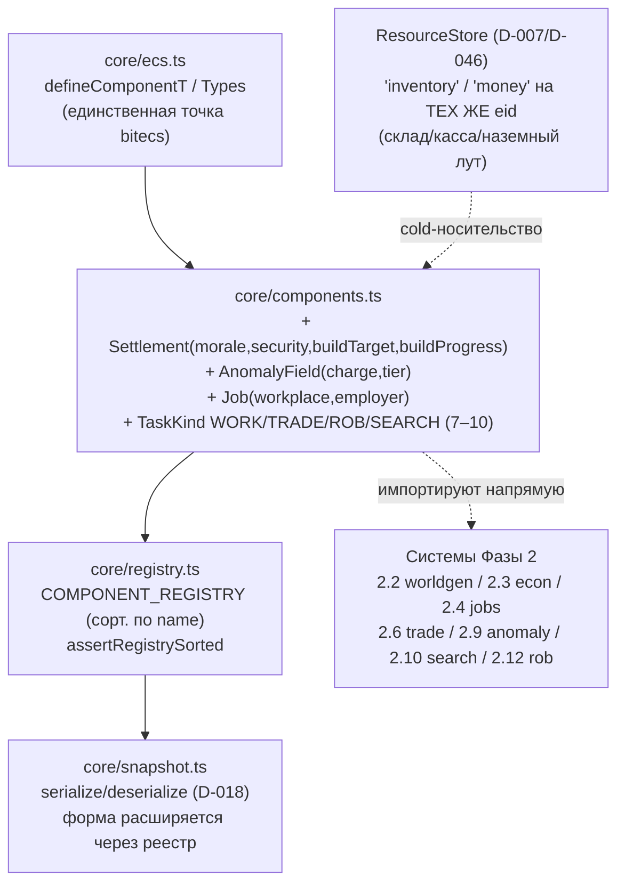

# Задача 2.1+2.8 — Определения SoA-компонентов Фазы 2 (Settlement/AnomalyField/Job)

Расширение реестра компонентов (D-046) поверх принятой инфраструктуры 1.2. Три
новых числовых data-компонента БЕЗ тега (носительство = «роль», как `Animal`) и
append-only коды `TaskKind` 7–10. Только ОПРЕДЕЛЕНИЯ и сериализация — логику систем
(worldgen 2.2, экономика 2.3/2.4, поля 2.9) эта задача не пишет.

## Зависимости модуля

## Раскладка данных (D-046): hot SoA vs cold ResourceStore на одном eid

| Хранилище | Что | Почему |
|-----------|-----|--------|
| **SoA `Settlement`** | morale:f32, security:f32, buildTarget:ui8, buildProgress:f32 | per-tick числа поселения; носительство = «сущность-поселение» |
| **SoA `AnomalyField`** | charge:f32, tier:ui8 | заряд/уровень поля; носительство = «аномальное поле» |
| **SoA `Job`** | workplace:ui32, employer:eid | трудоустройство NPC; носительство = «работает на поселение» (employer — eid-ссылка без ремапа, D-011) |
| **ResourceStore** (D-046) | склад/касса поселения, наземный лут поля — под теми же ключами `'inventory'`/`'money'` на ТОМ ЖЕ eid | строки/объекты/списки не ложатся в SoA; единый экономический учёт (D-045) |

## Порядок в реестре (сорт. по name, закон №8)

`alive · animal · **anomalyfield** · corpse · health · home · human · **job** · needs · position · **settlement** · skills · task · worldclock`

- `anomalyfield` между `animal` (`ani…`) и `corpse` (`ano…` > `ani…`, `< c…`);
- `job` между `human` и `needs`;
- `settlement` между `position` и `skills` (`se…` < `sk…`).

## Инварианты

- **Носительство = тип (D-046):** отдельного тега нет — наличие `Settlement`/`AnomalyField`/`Job` само задаёт роль (как `Animal`).
- **Коды append-only:** `TaskKind` 7–10 (WORK/TRADE/ROB/SEARCH) добавлены В КОНЕЦ; 0–6 не тронуты (стабильность формата снапшота, закон №8). Коды — ЗНАЧЕНИЯ ui8, не поля; порядок полей `Task` не изменён.
- **D-024:** `addComponent` зануляет поля новых компонентов → reuse eid не наследует значения покойника (проверено round-trip-тестом).
- **Границы типов:** f32/ui32/ui8/eid переживают serialize→deserialize побитово (round-trip каждого компонента).
- **Ёмкость `WORLD_CAPACITY=4096`:** поселения ~2–3, поля ~3–4, `Job` у части NPC — все ≪ 4096, потолок Фазы 1 сохранён.
- **Голдены не сдвинуты:** в текущем прогоне носителей новых компонентов нет (их создаст 2.2/2.9/2.4) → `components` для них пусты → пустой мир `481914ae`, day1/seed42 `cb104eca`, sim:100days `84359104` стабильны.
