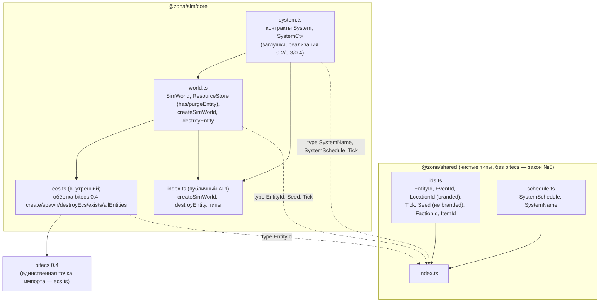

# Ядро 0.1 — каркас: граф зависимостей

Модули задачи 0.1 (типы `@zona/shared`, `SimWorld`, `ResourceStore`, обёртка bitecs).
Стрелка A → B означает «A импортирует B».

## Инварианты
- Закон №5: `bitecs` импортируется только в `ecs.ts`; `@zona/shared` не тянет движок.
  Тип `EcsWorld` и низкоуровневый `ecs.ts` НЕ реэкспортируются из публичного index.
- Закон №8: `ResourceStore.entries`/`allEntities` сортируют по возрастанию eid;
  `purgeEntity` обходит ключи отсортированно (детерминизм итерации).
- Закон №3 (риск C-6): bitecs 0.4 переиспользует eid → удаление сущности идёт ТОЛЬКО
  через `destroyEntity(world, eid)`, который делает ecs-destroy + `purgeEntity` (иначе
  новая сущность унаследует данные покойника). Версионирование bitecs на 0.1 не включаем.
- Поля `bus`/`rng` в `SimWorld`/`SystemCtx` появятся в задачах 0.4/0.3 — здесь их нет.
