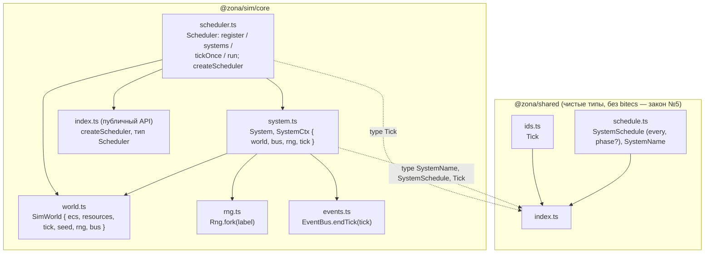

# Ядро 0.2 — планировщик тиков: граф зависимостей

Модули задачи 0.2 (`Scheduler` в `@zona/sim/core/scheduler`, расширенный
контракт `SystemCtx`/`System` в `core/system.ts`). Планировщик исполняет
системы по их `SystemSchedule` в порядке регистрации, фиксирует события тика и
продвигает время — БЕЗ замера времени (D-006). Стрелка A → B: «A импортирует B».



## Семантика тика (`tickOnce` на `world.tick === T`)
1. **due-фильтр** (закон №7 — частоты только из `schedule`): система due, когда
   `(T - phase) % every === 0` И `T >= phase`, где `phase = schedule.phase ?? 0`.
2. **исполнение** в ПОРЯДКЕ РЕГИСТРАЦИИ: для каждой due-системы собирается
   `ctx = { world, bus: world.bus, rng: world.rng.fork(`${name}@${T}`), tick: T }`
   и вызывается `update(ctx)`.
3. **`bus.endTick(T)`** — буфер событий тика переносится в лог (D-005). Если
   система опубликовала событие с чужим `tick`, endTick бросает (ловит рассинхрон).
4. **`world.tick = T + 1`** — время продвигается ровно на 1.

`run(world, ticks)` = `ticks` вызовов `tickOnce`. Без пауз/таймеров.

**Атомарность (всё-или-ничего):** цикл систем в try/catch; при исключении —
`world.bus.discardTick()` (сброс буфера) + rethrow, БЕЗ endTick и БЕЗ сдвига
`world.tick`. Упавший тик не оставляет следа → повтор `tickOnce` безопасен, без
дублей в append-only логе. `discardTick` (аддитивный метод шины, events.ts) не
откатывает `eventSeq`: id отброшенных событий сгорают (пропуски в EventId
допустимы — контракт требует монотонности/уникальности, не непрерывности, C-4).

## Инварианты
- **Закон №8 / детерминизм**: порядок систем = порядок `register` (массив, не
  Map/Set). Два прогона одного набора систем при одном seed дают идентичный лог
  вызовов и идентичные события.
- **D-006 / нет времени**: в `scheduler.ts` отсутствуют `Date.now`/`performance.*`
  в исполняемом коде (только в комментариях). Бюджет 1.6 мс/тик живёт в
  `@zona/headless`.
- **D-009 / rng по тикам**: метка форка `${name}@${tick}` включает НОМЕР ТИКА,
  поэтому `ctx.rng` различается по тикам (иначе `fork(name)` повторял бы поток
  каждый тик — скрытый недетерминизм), оставаясь детерминированным от
  `(rootSeed, name, tick)`; per-system rng-состояние между тиками не хранится
  (бонус для 0.5).
- **Закон №6 / изоляция систем**: `SystemCtx` не даёт ссылки ни на другую
  систему, ни на планировщик — только `world`, `bus`, `rng`, `tick`.
- **Валидация**: `register` бросает при пустом ИЛИ дублирующемся имени
  (уникальность имени = уникальность метки форка rng `${name}@${tick}`, D-009 —
  иначе коллизия потоков + двойное исполнение), при `every < 1` (или не целом)
  и `phase < 0` (или не целом); `run` бросает при `ticks < 0`.
```
