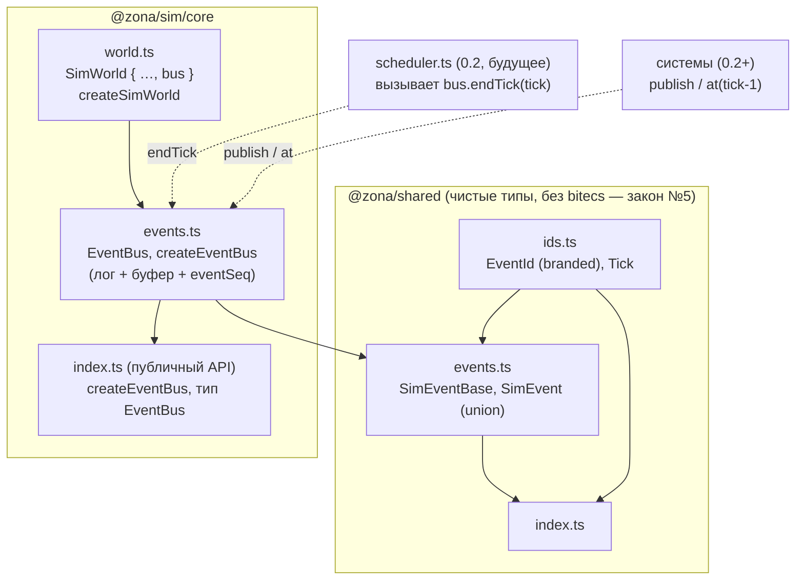
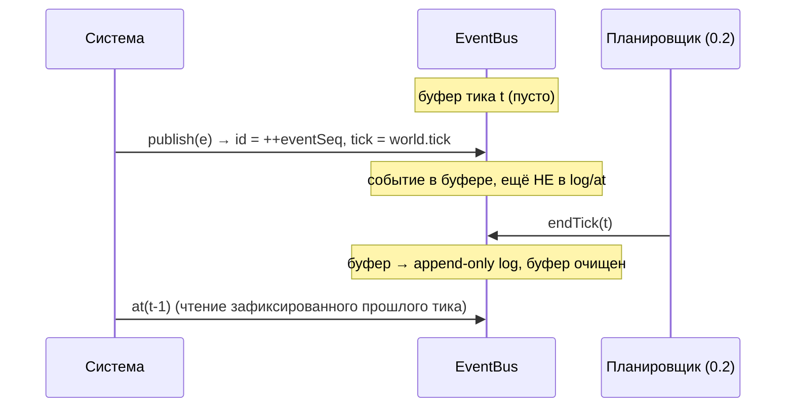

# Ядро 0.4 — шина событий: граф зависимостей

Модули задачи 0.4 (контракт `SimEvent` в `@zona/shared`, `EventBus` в
`@zona/sim/core/events`, интеграция в `SimWorld`). Стрелка A → B означает
«A импортирует B».

## Модель двух фаз (D-005)

Инварианты: id монотонны и не сбрасываются на `endTick` (C-4, `eventSeq`
сериализуется в 0.5); порядок лога = порядок `publish` (закон №8, массивы без
Map-итерации). Append-only защищён на трёх уровнях: (1) событие заморожено
целиком — шапка И `payload` (deep freeze, глубина 1); (2) геттер `log` отдаёт
копию (`slice`); (3) `at`/`drainSince` возвращают новые массивы (`filter`).
`endTick(tick)` сверяет, что все события буфера имеют этот `tick` (иначе бросок —
ловит рассинхрон планировщика). Восстановление 0.5: `createEventBus(getTick,
{ eventSeq, log })` продолжает последовательность id без коллизий (C-4).
