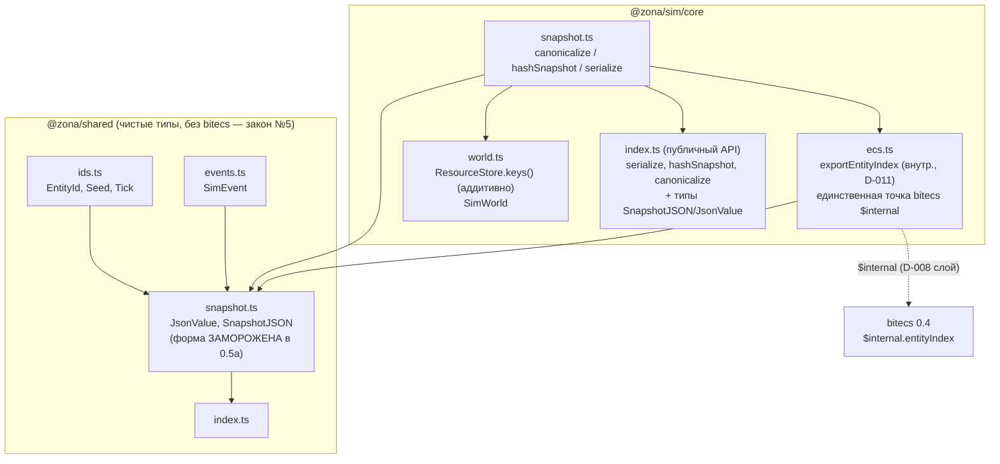
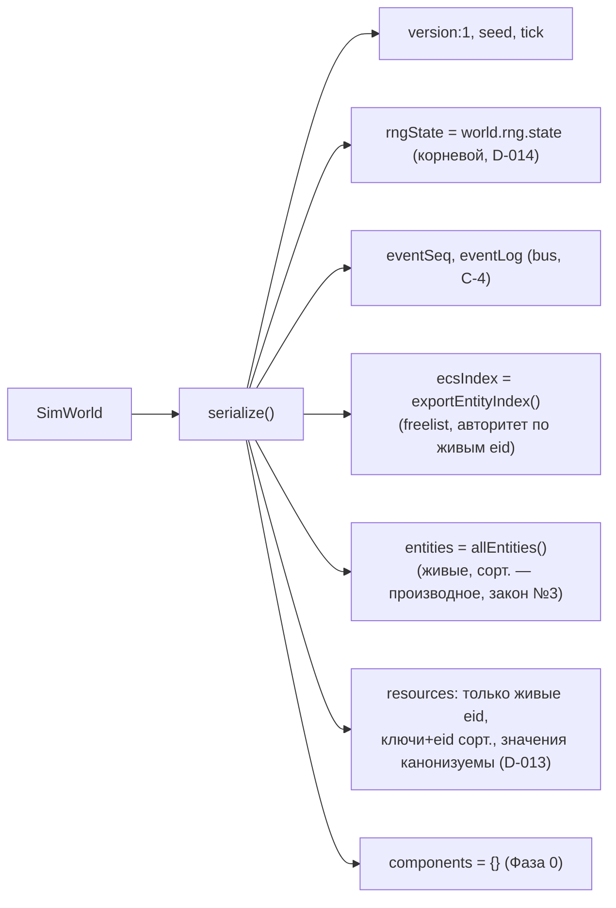

# Ядро 0.5a — сериализация (write-path): граф зависимостей

Модули задачи 0.5a: контракт `SnapshotJSON`/`JsonValue` в `@zona/shared`,
`exportEntityIndex` в `@zona/sim/core/ecs` (внутренний, D-011), а также
`canonicalize`/`hashSnapshot`/`serialize` в `@zona/sim/core/snapshot`.
Стрелка A → B означает «A импортирует B». Обратная сторона (`deserialize`,
`createEcsWorldFromIndex`) — задача 0.5b (D-015).



## Что и как сериализуется



## Инварианты (законы №8/№3, D-011/D-012/D-013/D-014)

- **Канонизатор (D-012/D-013).** Ключи объектов сортируются по возрастанию
  (UTF-16); массивы сохраняют порядок; числа — `Number.toString`,
  `NaN/±Infinity` → throw; строки — через `JSON.stringify`; `null` допустим.
  `undefined`/функция/символ/`bigint`/`Map`/`Set`/экземпляр класса/дыра массива →
  throw с указанием пути (`ctx` содержит ключ ресурса и eid). НЕ `JSON.stringify`,
  у которого порядок ключей = insertion order → нестабильный хэш (риск C-3).
- **hashSnapshot.** FNV-1a **32-бит** по кодовым единицам (UTF-16) каноничной
  строки; результат — 8 hex-символов. Инвариантен к порядку вставки ключей.
- **exportEntityIndex (D-011).** Клонирует реальную структуру `EntityIndex`
  bitecs 0.4: `aliveCount`, `dense` (все выданные eid длиной `maxId`: префикс
  `aliveCount` — живые, хвост — freelist), `sparse` (eid → индекс в `dense`),
  `maxId`, `versioning=false` (D-008), `versionBits`/`entityMask`/`versionShift`/
  `versionMask`. Разреженный `sparse` (дыра на индексе 0 — id 0 зарезервирован)
  нормализуется в ПЛОТНЫЙ массив: дыры → `0` (безопасно: id 0 никогда не жив,
  `dense[sparse[0]] !== 0`). Результат детерминирован и полностью JSON-safe.
- **Закон №3.** В снапшот попадают ТОЛЬКО живые eid: `entities` из
  `allEntities`, ресурсы фильтруются по множеству живых eid (защита сверх
  инварианта purge, D-008).
- **Закон №5.** `@zona/shared` не знает формы `ecsIndex` (для него `JsonValue`);
  bitecs `$internal` касается только `ecs.ts`.
```
