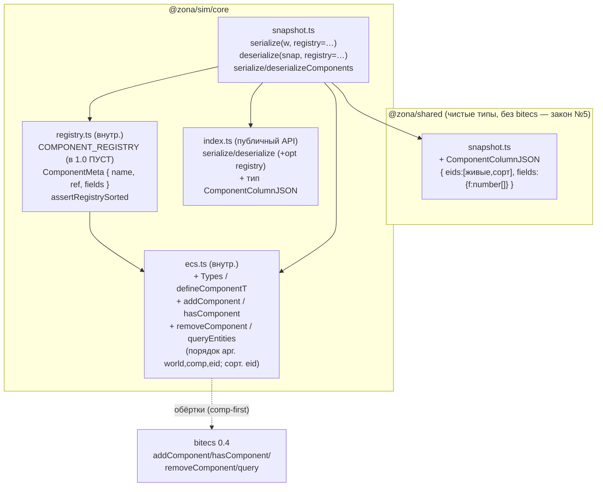
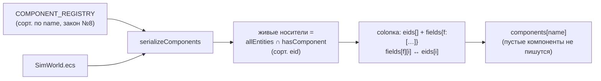

# Ядро 1.0 — реестр SoA-компонентов + сериализация компонентов: граф зависимостей

Задача 1.0 (D-018): научить ядро сериализовать/восстанавливать реальные bitecs
SoA-компоненты. Новый модуль `@zona/sim/core/registry` (источник истины формы
компонентов), аддитивные обёртки компонентов в `core/ecs`, расширение
`serialize`/`deserialize` в `core/snapshot`, заморозка формы колонки
`ComponentColumnJSON` в `@zona/shared`. Fail-fast D-016 (непустой `components` →
throw) СНЯТ. Стрелка A → B означает «A импортирует B».



## Как сериализуется SoA-компонент



## Инварианты (законы №8/№3/№5, D-018)

- **Реестр — источник истины (закон №8).** `serialize`/`deserialize` итерируют
  `COMPONENT_REGISTRY` (отсортирован по `name`), поля читаются/пишутся в
  ФИКСИРОВАННОМ порядке `meta.fields`. Не полагаемся ни на порядок ключей
  объекта-компонента, ни на внутренние имена bitecs. `assertRegistrySorted`
  бросает на дубле/несортировке/пустом имени (проверяется при загрузке модуля).
- **Изоляция singleton (тест-реестр).** Колонки компонента — модульные глобальные
  массивы, общие для всех миров. `serialize`/`deserialize` берут реестр ПАРАМЕТРОМ
  (по умолчанию — глобальный, в 1.0 пустой), поэтому детерминизм-гейт Фазы 0 не
  затрагивается, а тесты 1.0 передают свой тест-реестр без утечки тест-компонента.
- **f32-детерминизм (закон №8).** Поля `f32` — `Float32Array`: значение хранится
  уже округлённым до f32, поэтому `Number.toString` в канонизаторе стабилен между
  прогонами (double-массив нёс бы «шумные» младшие биты).
- **Закон №3 (ничего из воздуха).** В снапшот попадают ТОЛЬКО живые носители
  (пересечение с `hasComponent`); стая-значение мёртвого eid в глобальном массиве
  не течёт. На load: компонент на НЕ живом eid → throw (симметрия GUARD ресурсов —
  иначе `spawnEntity` с reuse eid унаследовал бы «призрачный» компонент).
- **D-024 (ghost при reuse eid, закон №3/№8).** `destroyEntity`/`removeComponent`
  НЕ чистят SoA-массивы, но `addComponent` ЗАНУЛЯЕТ все поля носителя на входе —
  единая точка чистки (симметрия активного purge D-008/C-6). Без этого
  переиспользованный eid, не переписавший поле, читал бы «холодное» значение
  покойника: оно текло бы в снапшот И рассинхронило continuous-vs-resume между
  процессами (сохранивший держит X в массиве, свежий после load — 0). Гейт:
  reuse-eid + cross-process на СВЕЖЕМ ref (падают без зануления).
- **Валидация инъецированного реестра.** `serialize`/`deserialize` вызывают
  `assertRegistrySorted(registry)` и на переданном параметром реестре (не только
  на глобальном при загрузке): дубль имени молча перезатёр бы колонку (закон №8).
- **Строгий read-path.** `deserialize`: неизвестное имя компонента → throw
  (снапшот из чужой схемы, D-018 снимает fail-fast D-016); дрейф набора полей,
  несовпадение длин `eids`/полей, не-конечные числа, кривая форма колонки → throw.
  `addComponent` дополнительно валидирует ёмкость (eid в границах колонок).
- **Обратная совместимость.** `SnapshotJSON.components` остаётся
  `Record<string, JsonValue>` (недоверенный вход → рантайм-валидация); форму
  фиксирует экспортируемый `ComponentColumnJSON`. Пустой реестр → `components:{}`,
  голден-хэш пустого мира `481914ae` не меняется.
- **Закон №5.** `@zona/shared` не знает bitecs; обёртки компонентов и реестр —
  внутренние (`core/ecs`, `core/registry`), тип движка bitecs наружу не течёт.
```
