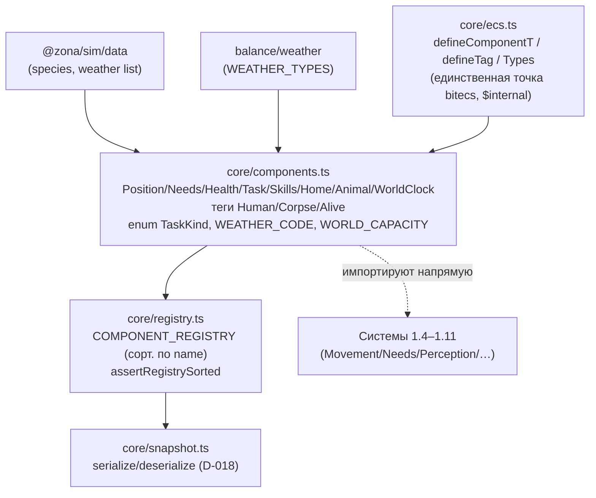

# Задача 1.2 — Определения доменных SoA-компонентов

Реестр числовых «горячих» компонентов (D-019) поверх инфраструктуры 1.0. Кодовые
пространства (`TaskKind`, `WEATHER_CODE`) — структура, не контент и не баланс.

## Зависимости модуля

## Раскладка данных (D-007 / D-019): SoA vs ResourceStore

| Хранилище | Что | Почему |
|-----------|-----|--------|
| **SoA-компоненты** (bitecs, числовое горячее) | Position(loc,dest,etaTicks), Needs(hunger,thirst,fatigue,fear), Health(hp), Task(kind,targetLoc,targetEid,startedTick), Skills(shooting,survival,stealth), Home(loc), Animal(species,herd), WorldClock(weather,weatherSince) | per-tick доступ, числа, типизированные массивы |
| **Теги** (членство без полей) | Human, Corpse, Alive | маркеры для query; сериализуются как `{eids:[…], fields:{}}` |
| **ResourceStore** (холодное объектное, D-007) | name, faction, profession, inventory, money | строки/объекты/списки, не ложатся в SoA |

## Инварианты

- **Реестр отсортирован по name** (закон №8); `assertRegistrySorted` при загрузке и на инъецированном реестре (serialize/deserialize).
- **Порядок полей фиксирован** и совпадает с ключами хранилища → детерминированный снапшот.
- **D-024:** `addComponent` зануляет все поля носителя → нет «призрака» при reuse eid (проверено на Needs/Health; тег снимается через членство bitecs).
- **Position без sentinel:** `dest===loc` ⇒ стоит; свежий носитель `loc=0`=Кордон валиден только после worldgen (1.3).
- **Коды append-only:** `TaskKind`/`WEATHER_CODE` — ui8-коды в снапшоте; новые значения только в конец, существующие не переставлять (как порядок полей).
- **Ёмкость `WORLD_CAPACITY=4096`:** явный потолок Фазы 1 (пик ~450, запас 10×); превышение → громкий `RangeError`, не тихая порча памяти.
- **Голдены пустого мира не сдвинуты:** компоненты без носителей → `components:{}`.
