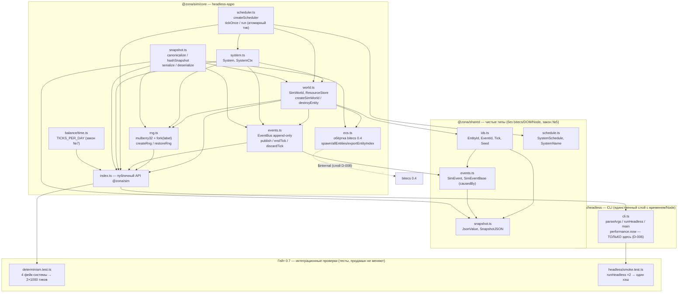
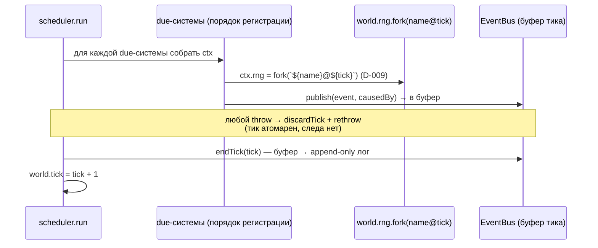

# Ядро Фазы 0 — обзорный граф модулей и инварианты (гейт 0.7)

Обзор ВСЕЙ Фазы 0: как собраны кирпичи задач 0.1–0.6 и какие инварианты
закрывает интеграционный гейт детерминизма 0.7. Стрелка `A → B` означает
«A импортирует/зависит от B». Пунктир — контролируемое касание чужого слоя.

Диаграммы по отдельным задачам: `core-0.1.md`, `core-0.2.md`, `core-0.4.md`,
`core-0.5a.md`. Здесь — крупный план целиком.

## Граф модулей ядра

## Поток одного тика (что доказывает детерминизм)

## Ключевые инварианты Фазы 0 (что закрывает гейт 0.7)

| Инвариант | Где живёт | Решение | Как проверяет гейт 0.7 |
|-----------|-----------|---------|------------------------|
| **Детерминизм по seed**: один seed → одна история (лог + хэш) | `rng.ts`, `scheduler.ts` | D-004, D-009, закон №8 | ТЕСТ A: seed=42 дважды → идентичный `bus.log` и `hashSnapshot` |
| **Чувствительность к seed**: rng не декоративен | `rng.ts` | D-004, закон №2 | ТЕСТ B: seed=43 ≠ seed=42 по логу и хэшу |
| **Атомарный тик** (всё-или-ничего) | `scheduler.ts`, `events.ts` | D-005 | косвенно: без исключений лог непрерывен, id монотонны (ТЕСТ A) |
| **Append-only лог + монотонный EventId** | `events.ts` | D-005, C-4 | ТЕСТ A: `id` строго возрастает в порядке публикаций |
| **Полная причинная цепочка** (`causedBy`) | `events.ts` | закон №6 | ТЕСТ A: каждая `causedBy` → существующее раннее событие; обрыв только в `null`; без циклов; есть цепочки глубины ≥ 2 |
| **Ничего из воздуха**: только живые eid; reuse без «призраков» | `world.ts`, `snapshot.ts` | D-007, D-008 | ТЕСТ A: рождения+смерти реальны, `maxId < всего рождённых` (freelist reuse) |
| **Resume-детерминизм**: save/load не сдвигает историю | `snapshot.ts`, `ecs.ts` | D-011, D-014, D-016 | ТЕСТ C: 1000 непрерывно === 500 + serialize/deserialize + 500 |
| **Порядок исполнения = порядок регистрации** (единственный tie-break) | `scheduler.ts` | D-006, закон №8 | ТЕСТ D: независимые системы коммутируют; делящие шину — стабильно нет |
| **Замер времени только в headless** | `headless/cli.ts` | D-006 | `ms` не входит в хэш (cli.test.ts); ядро времени не знает |
| **Константы — из /balance** | `balance/time.ts` | закон №7 | CLI переводит `--days` через `TICKS_PER_DAY`, не через «1440» |

## Как гейт остаётся «не холостым»

CLI Фазы 0 гоняет ПУСТЫЕ тики (реальных систем ещё нет) — на нём детерминизм
доказывался бы на пустом логе. Поэтому гейт 0.7 подсовывает планировщику 4
фейк-системы (`census` every 5, `birth` every 3, `mutation` every 2/phase 1,
`death` every 7/phase 2), которые реально рождают/хоронят сущностей, пишут
ресурсы и строят причинные цепочки. Тест ЯВНО утверждает, что лог не пуст и что
freelist eid задействован — иначе «зелёный» гейт был бы фикцией.
