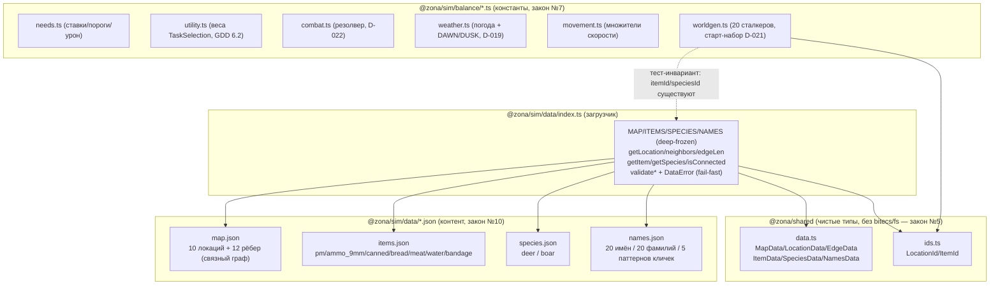

# Данные 1.1 — контент /sim/data + загрузчик + balance-константы: граф зависимостей

Задача 1.1 (закон №10/№7): ВЕСЬ контент (карта, предметы, виды, имена) вынесен в
`/sim/data/*.json`; загрузчик `data/index.ts` (внутренний модуль пакета, без
subpath-export — импортируется относительно, напр. `./data/index`) импортирует их
как МОДУЛИ (без fs, закон №5), валидирует по формам `@zona/shared`, глубоко
замораживает и отдаёт
типизированные структуры + хелперы. Балансовые константы (закон №7) сгруппированы
в `/sim/balance/*.ts`. Данные пока никем не потребляются в прогоне (голден-хэш
`c5dff40f` не меняется) — их подключат worldgen (1.3) и системы (1.2+).

Стрелка A → B означает «A импортирует B».



## Карта Зоны (10 локаций)

| id | Имя | Тип | water | shelter | danger | game | Соседи (id) |
|----|-----|-----|:-----:|:-------:|:------:|:----:|-------------|
| 0 | Кордон | settlement | ✔ | 9 | 0.05 | 0.20 | 1 |
| 1 | Свалка | ruins | – | 4 | 0.25 | 0.30 | 0, 2, 3 |
| 2 | Агропром | wild | ✔ | 5 | 0.30 | 0.50 | 1, 5 |
| 3 | Тёмная долина | wild | – | 3 | 0.45 | 0.55 | 1, 4, 5 |
| 4 | Дикая территория | wild | ✔ | 2 | 0.40 | 0.80 | 3, 5, 7 |
| 5 | Бар «Росток» | settlement | ✔ | 8 | 0.10 | 0.15 | 2, 3, 4, 6 |
| 6 | Янтарь | anomaly | ✔ | 3 | 0.60 | 0.35 | 5, 7 |
| 7 | Рыжий лес | anomaly | – | 2 | 0.75 | 0.65 | 4, 6, 8 |
| 8 | Припять | ruins | – | 6 | 0.70 | 0.25 | 7, 9 |
| 9 | Саркофаг | anomaly | – | 4 | 1.00 | 0.40 | 8 |

- **Связность (закон №8):** граф связен — BFS из локации 0 достигает все 10 узлов
  (тест `isConnected()` + BFS). Изолятов нет, каждое ребро ссылается на валидные
  id, `neighbors` симметричны и отсортированы.
- **Градиент опасности:** от безопасного Кордона (danger 0.05) к Саркофагу (1.0).
  Дичь гуще в глубине (Дикая территория 0.80, Рыжий лес 0.65) — «дичь глубже».
- **Источники воды** в 5 точках (0, 2, 4, 5, 6) — питьё не только в поселениях.
- **Два поселения-хаба:** Кордон (вход, D-021) и Росток (центральный узел, 4 ребра).

## Стартовые виды

| key | flees | power | melee | herd | reproCap | gestation (тиков) | meatYield |
|-----|:-----:|:-----:|:-----:|:----:|:--------:|:-----------------:|:---------:|
| deer (олень) | ✔ | 2 | 3 | 3–8 | 20 | 43200 (~30 сут) | 40 |
| boar (кабан) | – | 8 | 14 | 1–4 | 12 | 36000 (~25 сут) | 60 |

Олень — пугливый стадный слабак; кабан — агрессивный одиночка/малая группа, вдвое
опаснее в упор. `meatYield` — источник предмета `meat` при разделке туши (закон №3).

## Balance-инварианты (закон №7)

- Все ставки нужд > 0; критические пороги в (0, 100]; жажда острее голода.
- Веса utility конечны и |w|<10; `FALLBACK_SCORE_FLOOR > 0` (idle запрещён, D-020).
- Combat: точности в [0,1], min≤base≤max; раунды/патроны — положительные целые.
- Weather: DAWN(360) < DUSK(1260) < TICKS_PER_DAY; `isNight` НЕ хранится (D-019).
- Worldgen: 20 сталкеров; каждый `itemId` старт-набора и `speciesId` стад ссылается
  на реальную запись data (тест связности balance↔data — ничего из воздуха).
```
