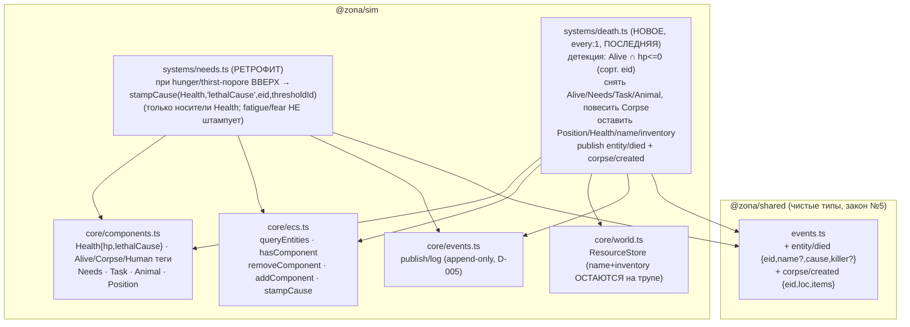
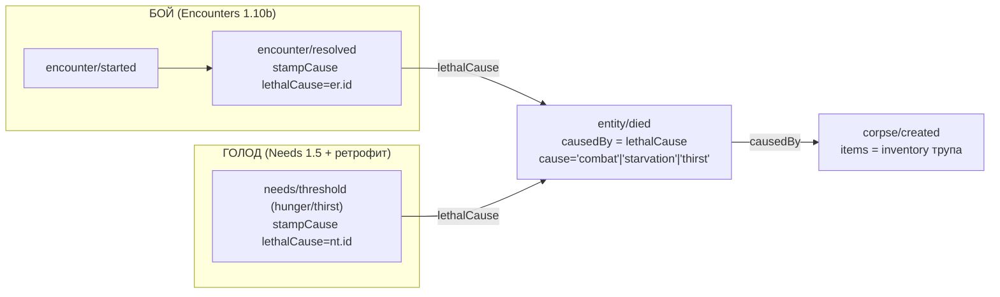
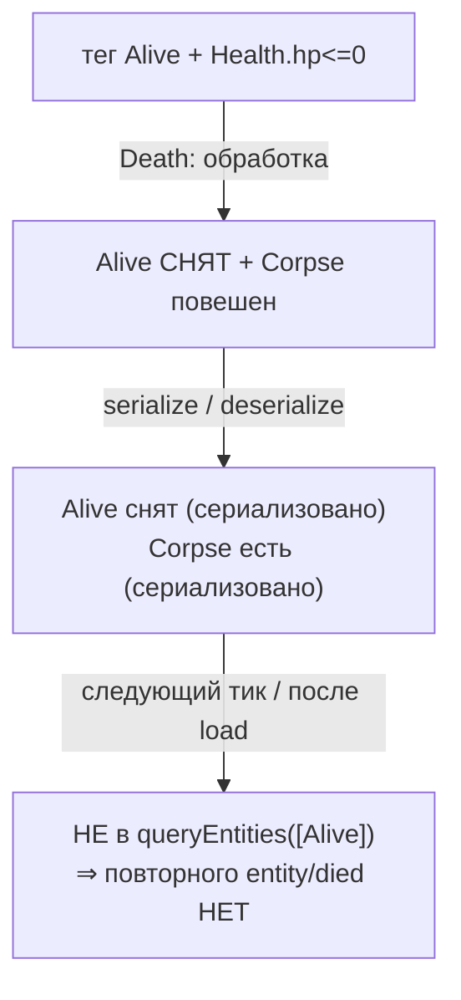

# Death 1.11 — смерть сущности + труп с лутом + ретрофит Needs на lethalCause

Задача 1.11 (Фаза 1). Новая система `@zona/sim/systems/death` (ПОСЛЕДНЯЯ в тике,
B.1) превращает добитого носителя тега `Alive` (`Health.hp <= 0`) в персистентный
ТРУП: снимает `Alive`/`Needs`/`Task`/`Animal`, вешает `Corpse`, оставляет
`Position` + `Health` + `name`/`inventory` (ЛУТ покойника, закон №3) и публикует
`entity/died` (причина наследована из `Health.lethalCause`, D-030) + `corpse/created`.
Ретрофит `Needs` (1.5): при пересечении hunger/thirst критического порога ВВЕРХ
штампует id `needs/threshold` в `Health.lethalCause` — чтобы голодная смерть была
объяснима. Death НЕ создаёт причину — читает её (закон №6). Стрелка A → B = «A
импортирует/зависит от B».

## Причинность смерти — наследование через lethalCause (закон №6, D-030)

Метка `cause` выводится РАЗОВО из типа события-причины (committed-лог по id): найдено
`encounter/resolved` → `combat`; `needs/threshold` → `thirst`/`starvation`; id не в
логе (опубликован в ЭТОМ тике — Death последняя, D-005; в Фазе 1 внутритиковый
штамповщик только Encounters) → `combat`; `lethalCause==0` → `unknown`. Связь
`causedBy` авторитетна, метка вторична.

## Resume-безопасность детекции смерти (закон №8, P0)

Флаг «уже умер» = САМО ОТСУТСТВИЕ тега `Alive` (переживает snapshot), а не
in-memory Set. Прямой аналог prev-детекции порога в Needs. Труп НЕ удаляется
(`destroyEntity`) — персистит с лутом; распад/лутание трупов — будущая фаза.
