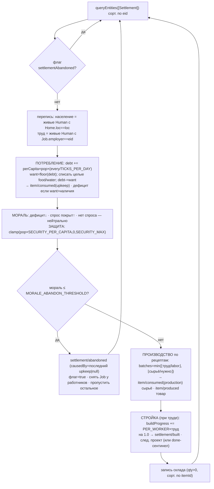

# Economy (2.3) — потребление / производство / стройка / мораль поселений

Система Economy оживляет поселения: жители ПРОЕДАЮТ провизию со склада, работники
ПРОИЗВОДЯТ товар из сырья и СТРОЯТ проекты очереди, а МОРАЛЬ/защита отражают
достаток/дефицит. Всё детерминировано из СОСТОЯНИЯ мира (закон №2, без rng), с
сохранением МАССЫ (закон №3 — леджер `item/consumed`/`item/produced`) и
resume-безопасностью (P0). НЕ входит в конвейер Фазы 1 (подключит 2.16), поэтому
голдены Фазы 1 (70e9e546/ee2ef84c/481914ae) не сдвигаются.

## Граф зависимостей

```mermaid
graph TD
  Economy["systems/economy.ts<br/>Economy (every:10)"]
  COMP["core/components.ts<br/>Settlement(morale,security,buildTarget,buildProgress)<br/>Position · Home · Job · Human(tag) · Alive(tag)"]
  ECS["core/ecs.ts<br/>queryEntities · hasComponent · removeComponent"]
  RES["core/world.ts (ResourceStore)<br/>'inventory' (склад) · 'money' (касса)<br/>'consumptionDebt' (дробный долг) · 'settlementAbandoned' (флаг)"]
  BUS["core/events.ts (world.bus)<br/>publish / log"]
  DATA["data/index.ts<br/>getSettlement · getItem<br/>(consumption.perCapita · recipes · buildQueue)"]
  BALE["balance/economy.ts<br/>ECONOMY_CADENCE · MORALE_* · SECURITY_* · BUILD_PROGRESS_PER_WORKER"]
  BALT["balance/time.ts<br/>TICKS_PER_DAY"]
  EV["@zona/shared/events.ts<br/>item/consumed{reason:upkeep|production} · item/produced<br/>settlement/built · settlement/abandoned"]

  Economy --> COMP
  Economy --> ECS
  Economy --> RES
  Economy --> BUS
  Economy --> DATA
  Economy --> BALE
  Economy --> BALT
  Economy --> EV

  WG["worldgen 2.2"] -. склад/касса/мораль поселения = БАЗЛАЙН t0 (без леджера) .-> RES
  Job24["Jobs 2.4 (будущее)"] -. навешивает Job.employer ⇒ труд (произв./стройка) .-> COMP
  EI["EconomyInvariant (headless, D-045)"] -. сверяет worldTotals − baseline == ledgerDelta .-> BUS
  Pipe216["registerPhase1Systems 2.16 (будущее)"] -. подключит Economy в конвейер .-> Economy
```

## Порядок обработки одного поселения (по eid, детерминированно)



## Ключевые инварианты

- **Закон №3 (масса).** Потребление УНИЧТОЖАЕТ (`item/consumed` upkeep/production),
  производство СОЗДАЁТ (`item/produced`) — оба ЛЕДЖЕРЯТСЯ. `worldTotals − baseline ==
  ledgerDelta` держится точно (EconomyInvariant, headless): склад/касса поселения
  считаются наравне с NPC (D-046). Склад ВСЕГДА целочислен — дробный спрос копится в
  `consumptionDebt`, со склада списываются лишь целые юниты (нет плавающей ошибки в
  массе).
- **Закон №2 (причинность).** Ни одной проверки «X% шанс»: потребление/мораль/
  производство/стройка/заброшенность — арифметика и пороги от состояния мира. rng не
  используется.
- **Закон №8 (детерминизм / resume).** Обходы — `queryEntities` (сорт. по eid); внутри
  склада — по возрастанию itemId. Весь накопитель дробного долга, мораль, прогресс,
  флаг заброшенности — в СЕРИАЛИЗУЕМОМ состоянии (Settlement-компонент + ResourceStore)
  ⇒ split (run→save→load→run) ≡ continuous по хэшу.
- **Объяснимость (B5).** `settlement/abandoned.reason` называет причину (затяжной
  дефицит провизии + до какой морали), `causedBy` → последний дефицитный
  `item/consumed(upkeep)` (или `null`, если склад был пуст).
- **Труд = Job (2.4).** Производство и стройка идут ТОЛЬКО при работниках
  (`Job.employer==eid`). В 2.3 наём ещё не назначается штатно ⇒ без работников их
  вклад = 0 (ожидаемо); тесты навешивают Job вручную.

## События

| Тип | payload | causedBy | леджер массы |
|-----|---------|----------|--------------|
| `item/consumed` (reason `upkeep`) | who, item, qty, reason | `null` | −qty |
| `item/consumed` (reason `production`) | who, item, qty, reason | `null` | −qty |
| `item/produced` | settlement, item, qty | `null` | +qty |
| `settlement/built` | settlement, project | `null` | — |
| `settlement/abandoned` | settlement, reason | последний upkeep \| `null` | — |
