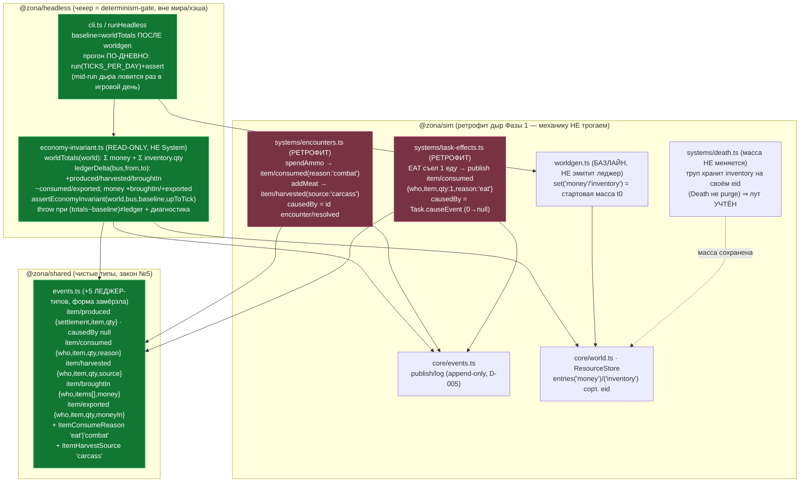

# EconomyInvariant 2.0 — предохранитель закона №3 (масса вне леджера = падение)

Задача 2.0 (Фаза 2, ПЕРВОЙ, D-045). Замкнутая экономика проверяется ОДНОЙ
формулой: «масса мира» = Σ `money` + Σ `inventory`.qty по item по ВСЕМ eid
(NPC/трупы/поселения единообразно, D-046). Единственный легальный способ
ИЗМЕНИТЬ массу — 5 ЛЕДЖЕР-событий `item/*` в `@zona/shared/events`. Read-only
чекер `@zona/headless/economy-invariant` сверяет для каждого `upToTick`:

```
worldTotals(now) − baseline  ==  ledgerDelta(0, upToTick)
```

`baseline` = `worldTotals` сразу ПОСЛЕ worldgen (t0): стартовый инвентарь/деньги —
БАЗЛАЙН, worldgen НЕ эмитит леджер. Расхождение ⇒ масса появилась/исчезла БЕЗ
события (дыра закона №3) ⇒ `assertEconomyInvariant` БРОСАЕТ (роняет sim:100days).

Чекер — НЕ система (не публикует, не мутирует мир, не входит в хэш/лог, вне
бюджета D-006): он живёт в headless как determinism-gate. Ретрофит дыр Фазы 1:
`TaskEffects.EAT → item/consumed(eat)`, `Encounters → item/consumed(combat) +
item/harvested(carcass)`. `produced/broughtIn/exported` — заготовки (форма
замёрзла, реально не эмитятся в 2.0). Стрелка A → B = «A зависит от B / A → B поток».



## Инвариант, который доказан

- **Наследие чисто (0 магии):** на полном конвейере Фазы 1 (worldgen + 9 систем)
  формула держится на КАЖДОМ дне для seed 42/7/999 (тест `economy-invariant.test.ts`)
  и на 100 днях в `sim:100days` (не бросает). Единственные изменения массы —
  `item/consumed` (еда/патроны) и `item/harvested` (мясо с туш).
- **Чекер реально ловит:** искусственная подкладка предмета/денег или удаление
  инвентаря БЕЗ леджера → `assertEconomyInvariant` бросает (проверено тестом).
- **Детерминизм:** ретрофит добавил события в лог → новые голдены живого мира
  `8a8faff4 → cb104eca` (day1/seed42), `f4cc990d → 84359104` (sim:100days).
  Core-голден пустого мира `481914ae` НЕ тронут (чекер вне ядра).
```
