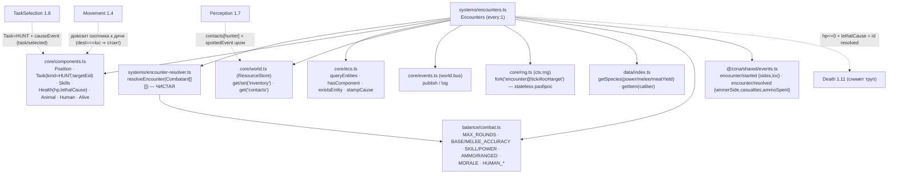

# Encounter Resolver + Encounters (1.10b) — единый резолвер боёв, охота человек-vs-животное

Задача 1.10b даёт ДВА модуля: `encounter-resolver.ts` — ЧИСТУЮ функцию над
`Combatant[][]` (единый резолвер для ЛЮБЫХ столкновений, D-022), и систему
`encounters.ts` — детекцию боёв из состояния мира, вызов резолвера и применение
исхода (патроны/hp/lethalCause/мясо).

## Граф зависимостей



## Порядок в тике (B.1)

`… Movement · TaskEffects → **Encounters** → Animals · Death …`
Encounters идёт ПОСЛЕ Movement/TaskEffects (охотник уже прибыл/стоит) и ДО Death
(она снимет помеченных `hp<=0 + lethalCause`).

## Ключевые инварианты

- **D-022 (единый резолвер, вид НЕ хардкодится):** `resolveEncounter` работает над
  абстрактными `Combatant{eid,side,power,ammo,melee,health}`. Зверь = комбатант
  `ammo=0, melee>0, power` из species.json; стрелок = `ammo>0, power = навык×оружие`.
  Человек-vs-человек (Фаза 2) пойдёт ТОЙ ЖЕ сигнатурой — тест-заглушка «две стороны
  из людей» уже резолвится этим кодом.
- **Закон №2 (РАЗБРОС, а не «X% шанс убить»):** единственный rng — физический
  РАЗБРОС выстрела/удара (`rng.next()` — отклонение ствола/руки). Попадание —
  ДЕТЕРМИНИРОВАННОЕ геометрическое следствие: `spread < acc(power)`, где `acc` —
  «конверт точности» из силы/навыка и констант balance. Урон/выбывание/слом
  морали/победа выведены из СОСТОЯНИЯ боя (health/потери/пороги), не из «шанса
  события». Решение о завязке боя — тоже состояние (человек с HUNT встал в локации
  с живой дичью), без «шанса нападения».
- **Закон №3 (физически):** патроны СПИСЫВАЮТСЯ из инвентаря стрелка на сумму
  `ammoSpent` (новый массив через `resources.set`, не in-place); мясо ДОБАВЛЯЕТСЯ
  победителю ровно `species.meatYield` за каждое убитое животное из `loot` —
  источник ТУША (без победы/убийства мяса нет). Ничего из воздуха.
- **Закон №6 / D-030 (причинность через штампы):** `encounter/started.causedBy` =
  `spottedEvent` цели из `contacts` мин-eid охотника → иначе `Task.causeEvent`
  (штамп `task/selected`) → иначе `null`. `encounter/resolved.causedBy` = id
  `started`. Убитым штампуется `Health.lethalCause = id resolved` — Death (1.11)
  прочитает и выставит `entity/died.causedBy`. Encounters сам НЕ удаляет и НЕ метит
  Corpse.
- **Закон №8 + RESUME (P0):** бой резолвится ЦЕЛИКОМ в одном тике → нет боевого
  состояния между тиками. rng — `ctx.rng.fork('encounter@tick#loc#target')`,
  stateless (выводится из label, D-004); метка УНИКАЛЬНА на (tick, loc, target) —
  два одновременных боя в одной локации (разная дичь) получают НЕЗАВИСИМЫЕ потоки
  разброса. Обход локаций/животных/охотников и запись hp — по возрастанию eid/loc.
  Непрерывный прогон ≡ split save/load (доказано хэшем снапшота).
- **Нет дубля до Death:** убитое (но ещё не снятое) животное имеет `hp<=0` при живом
  теге `Alive`; детекция фильтрует `hp>0`, поэтому труп не переигрывается следующим
  тиком (пока Death 1.11 его не снимет).

## Модель раунда резолвера

Раунды `1..maxRounds` внутри функции (не по тикам). В каждом: снимок живых →
каждый (сорт. по `(side,eid)`) бьёт мин-eid врага из другой стороны ПО СНИМКУ
(синхронно, без первохода) — выстрел (тратит `AMMO_PER_ROUND`, урон
`RANGED_HIT_DAMAGE`) или удар в упор (урон = свой `melee`), попадание `spread<acc`.
Урон применяется после обхода. Развязка: сторон с живыми `<=1` → победа/взаимное
уничтожение; иначе слом морали (`потери/начало >= MORALE_BREAK_FRACTION`) → бегство
сломанных; `maxRounds` без развязки → пат.

## Пример

```ts
import { Encounters } from '@zona/sim/systems/encounters';

// Порядок B.1: после Movement/TaskEffects, ДО Animals/Death.
sched.register(Movement);
sched.register(TaskEffects);
sched.register(Encounters); // детект HUNT-боёв → resolveEncounter → применить исход
// sched.register(Animals);
// sched.register(Death);    // 1.11 снимет hp<=0 + lethalCause
```

Прямой вызов резолвера (чистая функция):

```ts
import { resolveEncounter } from '@zona/sim/systems/encounter-resolver';

const hunter = { eid: 10, side: 0, power: 6, ammo: 16, melee: 5, health: 100 };
const deer   = { eid: 20, side: 1, power: 2, ammo: 0,  melee: 3, health: 100 };
const out = resolveEncounter({ loc, sides: [[hunter], [deer]], cause: null, rng, maxRounds: 6 });
// out.winnerSide === 0; out.casualties === [20]; out.ammoSpent === [[10, N]];
// deer.health <= 0 (итог записан обратно в переданный Combatant — out-канал).
```
