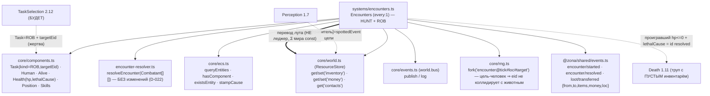

# Encounters 2.11 — человек-vs-человек (грабёж) + перевод лута

Задача 2.11 РАСШИРЯЕТ систему `encounters.ts` (без нового модуля и без изменения
резолвера D-022): та же детекция+резолвер теперь разрешает и грабёж человек-vs-
человек, а при исходе ПЕРЕВОДИТ лут проигравшего победителю (D-060/D-049). Решение о
завязке грабежа driven задачей `Task.kind===ROB` (её выбор — задача 2.12); пока никто
ROB не выбирает, ветка ДРЕМЛЕТ ⇒ голдены Фазы 1 (`sim:100days=37a19d72`, пустой мир
`481914ae`) не сдвигаются.

## Граф зависимостей (дельта к 1.10b)



## Детекция грабежа (параллельна HUNT)

Кандидат-грабитель: `Human, Alive` с `Task.kind===ROB`, СТОЯЩИЙ (`Position.dest===loc`),
чья цель `Task.targetEid` — СУЩЕСТВУЮЩИЙ живой `Human` в ЕГО локации, тоже стоящий
(existsEntity+Human+Alive+Health+co-located+dest===loc). Тот же гейт цели, что у HUNT,
но БЕЗ fallback (нет валидной цели ⇒ грабежа нет). Группировка по `(loc, target)` в тот
же реестр боёв, что и охота: цели-животные и цели-люди имеют непересекающиеся eid ⇒
ключи `${loc}#${target}` не коллидируют. `side0` — грабители, `side1` — САМА ЦЕЛЬ
(ЗАЩИЩАЕТСЯ как полноценный `Combatant`: стреляет своим оружием/патронами, не пассивна).

## Сборка Combatant

`humanCombatant(eid, side)` — ЕДИНАЯ сборка для ЛЮБОЙ стороны-человека (охотник,
грабитель, защищающаяся цель): `power = shooting×HUMAN_WEAPON_POWER` (0 без оружия),
`ammo` калибра оружия, `melee = HUMAN_UNARMED_MELEE`, `health = Health.hp`. Идентична
прежней инлайн-сборке охотника ⇒ путь HUNT байт-в-байт неизменен (голдены стабильны).

## Перевод лута (D-060/D-049 «лут — перевод конс.»)

- **Политика: победитель забирает ВЕСЬ инвентарь И ВСЕ деньги ПРОИГРАВШЕГО** (не
  «часть/ценное»). Проигравшая сторона — ВСЕ её бойцы (мёртвые И сбежавшие); получатель
  — МИН-eid ЖИВОЙ человек победившей стороны. Симметрично: защитившаяся цель грабит
  напавших (проигравший→победитель, без спец-случая инициатора). Условие: резолвер
  вернул `disposition==='sideWon'` и есть живой человек-победитель.
- **Закон №3 (масса СОХРАНЕНА бит-в-бит):** лут физически ПЕРЕЕЗЖАЕТ (новые массивы
  через `resources.set`, D-035), `from` обнуляется. Σ денег и Σ каждого предмета мира
  НЕ меняются ⇒ это ПЕРЕВОД, а НЕ леджер `item/*`. EconomyInvariant (D-045) видит
  дельту 0 (как торговля D-047 и подбор артефакта D-057). Патроны боя — ОТДЕЛЬНО:
  их расход ЛЕДЖЕРится `item/consumed(combat)` (масса патронов реально уничтожается).
- **Нет двойного учёта с трупом (D-041):** Encounters идёт ДО Death в тике, поэтому
  лут снимается с проигравшего РАНЬШЕ, чем Death делает труп ⇒ `corpse/created.items`
  ПУСТ (лут уже у победителя). Масса не задваивается и не исчезает: в 1v1 проигравший
  всегда ГИБНЕТ (сторона из 1 бойца не «ломается живой» — порог морали требует
  потери=смерти), поэтому типичный грабёж = обчищенный труп.

## Причинность (D-030)

`encounter/started.causedBy` = `spottedEvent` цели из `contacts` мин-eid грабителя →
иначе `Task.causeEvent` (штамп `task/selected`) → иначе `null`.
`encounter/resolved.causedBy` = id `started`. `loot/transferred.causedBy` = id
`resolved` (перевод лута — следствие исхода). Убитой цели штампуется
`Health.lethalCause = id resolved` (Death снимет и выставит `entity/died.causedBy`).

## Изоляция от голденов

ROB-задач в живом мире нет до 2.12 ⇒ детекция грабежа находит 0 боёв ⇒ реестр боёв ==
только охотничьи, порядок сорт. по `(loc, target)` идентичен, rng-метки те же ⇒
`sim:100days=37a19d72`, пустой мир `481914ae` НЕ сдвигаются. Тот же паттерн изоляции,
что ArtifactSearch/Trade без своих полей. Blanket-агрессии по фракционной вражде НЕТ —
грабёж driven ТОЛЬКО задачей ROB (утилити-грабёж/обход групп — эмерджентно 2.12).

## Пример (синтетический ROB-сетап, дремлющая ветка активируется задачей)

```ts
// side0 — грабитель с ROB на жертву; side1 — жертва защищается.
Task.kind[robber] = TaskKind.ROB;   // 2.12 выберет это по utility (D-049)
Task.targetEid[robber] = victim;    // co-located живой Human
sched.register(Encounters);         // детект ROB → resolveEncounter → перевод лута
sched.register(Death);              // труп жертвы с ПУСТЫМ инвентарём (лут у грабителя)
// Итог: victim.hp<=0, loot/transferred{from:victim,to:robber,...}, Σ массы мира const.
```
