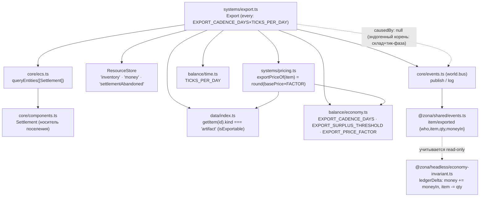
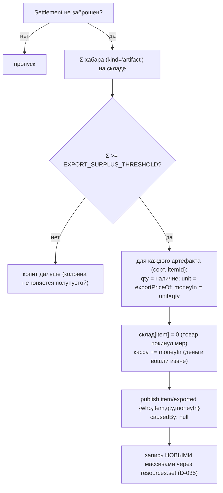

# Экспорт за Периметр (2.7, D-055) — зависимости и поток

Система `Export` — ЕДИНСТВЕННЫЙ санкционированный money-faucet замкнутого мира
(закон №3). Поселение по СОСТОЯНИЮ склада на детерминированном логистическом тике
вывозит накопленный ХАБАР (артефакты) «за Периметр»: товар ФИЗИЧЕСКИ покидает мир,
деньги ФИЗИЧЕСКИ входят — оба факта проводит леджер `item/exported` (D-045), поэтому
EconomyInvariant держится. НЕ в pipeline/worldgen до 2.16 (голдены Фазы 1 не двигаются).

## Граф зависимостей

## Поток одного логистического тика (на носитель Settlement, сорт. по eid)

## Инварианты

- **Закон №1 (без игрока):** поселение само шлёт колонну по состоянию склада.
- **Закон №3 (масса):** деньги появляются ТОЛЬКО здесь и ТОЛЬКО через `item/exported`;
  склад не в минус (вывозится лишь наличие). `worldTotals − baseline == ledgerDelta`.
- **Закон №2 (причинность):** тик-фаза логистики + порог склада, никакого «X% отправки».
- **Закон №8 (детерминизм):** обход по eid, позиции по itemId, rng не используется;
  склад/касса сериализуемы ⇒ split ≡ continuous.
- **Закон №10 (данные):** экспортность — КАТЕГОРИЯ `kind==='artifact'`, не хардкод id.

## Хвост

Подключение в `registerPhase2Systems` и полный цикл поле → сталкер (SEARCH) →
торговля → накопление хабара на складе → экспорт — задача 2.16.
