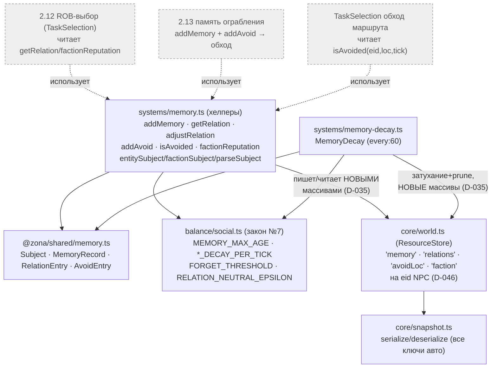
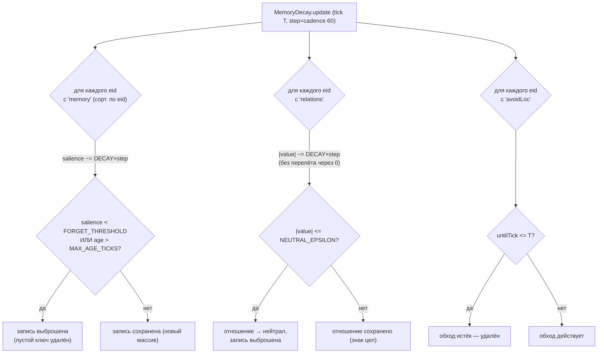

# Память / отношения / обход + MemoryDecay (2.15, D-050/D-058)

Субстрат «мозга» NPC для цепочки бандитов (2.11 encounters людей → 2.12 ROB-решение →
2.13 память ограбления + обход маршрута). Три «холодных» ключа ResourceStore на eid NPC
(plain JSON, сорт. массивы, D-007/D-013/D-046, **НЕ** SoA — как inventory/money):

- **`'memory'`** → `MemoryRecord[]` — что NPC помнит; каждая запись несёт `causeEvent`
  (EventId события-причины, D-038) и `salience` (сила, затухает), `isFirsthand` (личное
  восприятие vs слух).
- **`'relations'`** → `RelationEntry[]` = `[subject, value]` сорт. по subject; value∈[−1..1].
- **`'avoidLoc'`** → `AvoidEntry[]` = `[loc, untilTick]` сорт. по loc.

Субъект памяти/отношения — единый **строковый** ключ `Subject` (закон №8): сущность
`"e:<eid>"`, фракция `"f:<factionId>"` (однородная сортировка, как inventory по item).

Два артефакта задачи:

- **MemoryDecay** (`systems/memory-decay.ts`, `every:60`, изолированная) — ДЕТЕРМИНИРОВАННОЕ
  затухание salience / остывание отношений к нейтралу / чистка истёкшего обхода. rng НЕ
  используется (закон №2). Тихая (событий не публикует). No-op на живом мире (worldgen не
  пишет эти ключи до 2.16) ⇒ голдены Фазы 1 целы.
- **Хелпер-API** (`systems/memory.ts`, чистые функции) — addMemory/getRelation/adjustRelation/
  addAvoid/isAvoided + DERIVED factionReputation. Субстрат для 2.12/2.13/TaskSelection; сам
  ROB-выбор здесь НЕ реализован.

## Граф зависимостей

## Затухание — детерминированная функция времени (закон №2, БЕЗ rng)

## Главный тест (закон №1) и resume

- **Без игрока**: затухание зависит только от `salience`/`value`/`tick` записей — идёт,
  даже если в мире нет ни одного живого наблюдателя.
- **Resume ≡ continuous** (закон №8): ключи `'memory'`/`'relations'`/`'avoidLoc'` — обычные
  ResourceStore-записи, `serialize`/`deserialize` пишут их автоматически (`resources.keys()`
  перечисляет все непустые ключи); затухание не зависит от рантайм-таймера ⇒ split
  save/load даёт тот же хэш, что непрерывный прогон (доказано тестом).
- **Голдены Фазы 1 целы**: MemoryDecay вне pipeline, worldgen не создаёт этих записей ⇒
  no-op ⇒ `sim:100days` 37a19d72 и пустой мир 481914ae неизменны.
