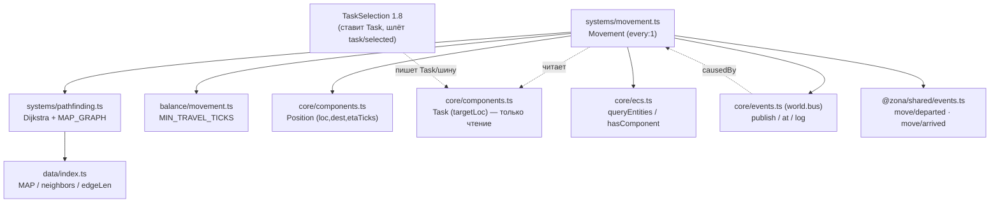
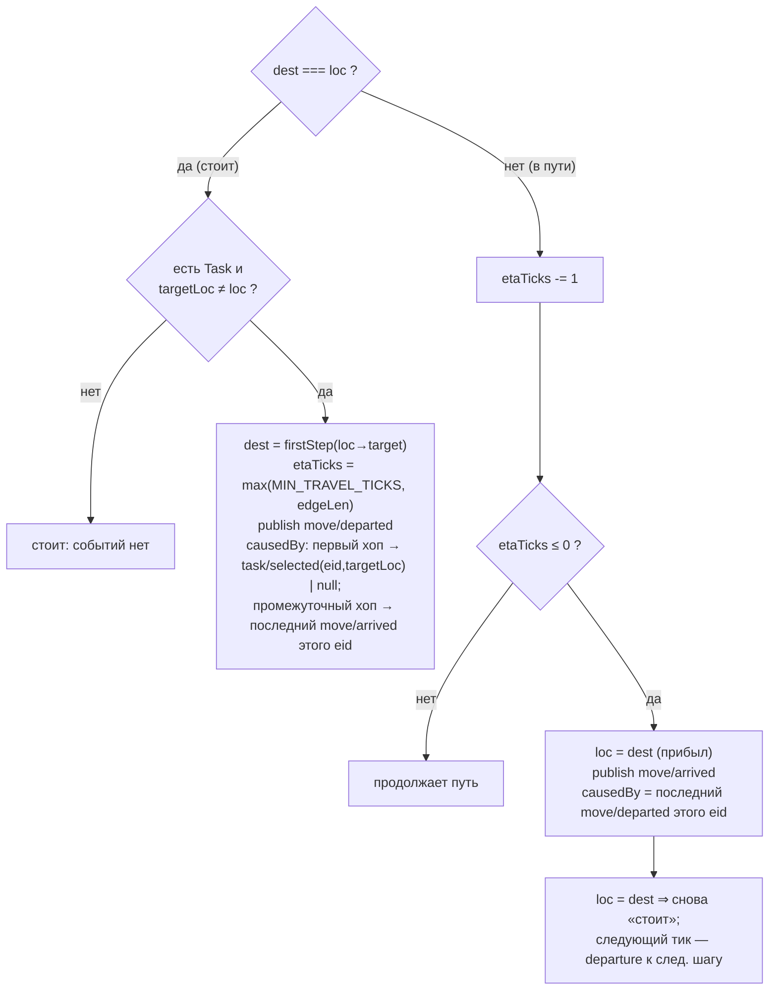

# Movement (1.4) — зависимости и поток

Система Movement перемещает носителей `Position` по графу локаций к
`Task.targetLoc` кратчайшим путём. Читает `Task` (ставит TaskSelection 1.8),
пишет `Position`, публикует `move/departed`/`move/arrived` в шину.

## Граф зависимостей

## Модель транзита (одна ветка на тик)

Одиночный переход занимает ровно `edgeLen` тиков (departure@T → arrival@T+edgeLen).
Мультихоп: между хопами один тик-передышка на промежуточном узле (по контракту
B.1 «на следующем тике departs дальше»). Кратчайший путь по `edgeLen` сам не
заходит в тупик Саркофаг (loc 9, degree=1), поэтому спец-обработки danger в
Movement нет — это забота TaskSelection (D-025).
