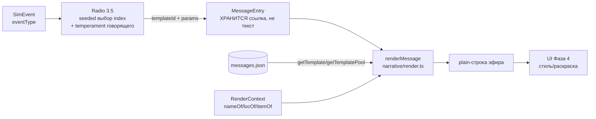

# Нарратив 3.4 — шаблоны сообщений + renderMessage (D-069)

Чистый headless-форматтер: из `templateId + params` собирает plain-строку, читая
пул шаблонов из `/sim/data/messages.json` (закон №10). НЕ система, в тик не входит.

## Формат messages.json

```
{
  "version": 1,
  "temperaments": ["neutral", "panicky", "veteran", "talker"],
  "templates": {
    "<eventType>": {                 // тип из @zona/shared/events, напр. "entity/died"
      "<temperament>": [             // код MessageTemperament; "neutral" ОБЯЗАТЕЛЕН
        "шаблон с {subject} {loc} {count} {item} {speaker}", ...
      ]
    }
  }
}
```

- Пул 15–25 шаблонов на ТИП события (GDD §8.3). Сейчас 17/тип × 7 типов = 119.
- Плейсхолдеры: `{speaker} {subject} {loc} {count} {item}`.
- `validateMessages` (data/index.ts) — fail-fast: пустой пул / неизвестный
  плейсхолдер / `<`/`>` (закон №5) / нет `neutral` / пул < 15 → `DataError`.

## Поток данных



## Контракт templateId

`"<eventType>|<temperament>|<index>"` — `makeTemplateId`/`parseTemplateId`.
Битый/неизвестный id → мягкий фолбэк (пул темперамента → `neutral` → строка помех),
НЕ throw (порчу контента ловит валидатор при загрузке).

## Стык с соседними задачами

- 3.3 Personality вводит `{temperament, talkativeness}` — отображает temperament в
  коды `MessageTemperament` (`neutral|panicky|veteran|talker`).
- 3.5 Radio — seeded-выбор `templateId`, эмит события radio/message, зовёт `renderMessage`.
- 3.6 Rumors — искажение `params`/выбора (ошибка наблюдения, искажение ретрансляции,
  ложь) поверх той же формы `{templateId, params}`.
