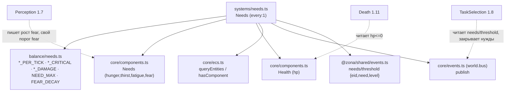
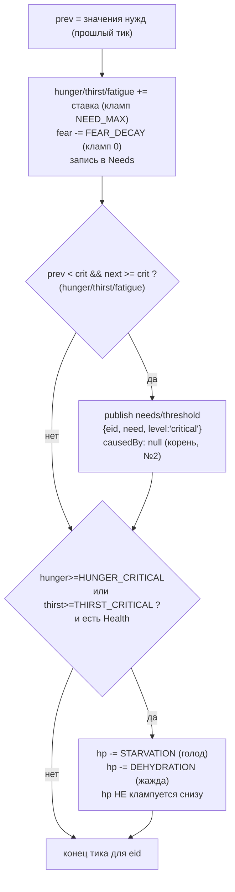

# Needs (1.5) — зависимости и поток

Система Needs — физиология NPC. Для каждого носителя `Needs` копит голод/жажду/
усталость, затухает страх, публикует `needs/threshold` при пересечении критических
порогов и наносит урон истощения в `Health.hp` (только голод/жажда). КОРЕНЬ
причинной цепочки мира (закон №2): растёт из состояния тела, а не по «X% шанс».
Needs НЕ владеет смертью (пишет hp, снятие сущности — Death 1.11) и НЕ
восстанавливает нужды (еда/питьё/сон — TaskSelection 1.8).

## Граф зависимостей

## Поток одного тика (на каждого носителя Needs, сорт. по eid)

Детекция «уже сообщено» — без доп. поля: сравнение значения ДО/ПОСЛЕ накопления
(prev = прошлый тик). Пока нужда держится выше порога, prev уже >= crit →
повтора нет; упала ниже и снова выросла → новое пересечение → новое событие.
Усталость даёт порог, но урона не наносит (сон — забота 1.8, не смерть). rng не
используется: физиология здесь чисто арифметическая (закон №2).

## Скорость жизни (стартовый баланс, тюнингует balance-analyst)

1 тик = 1 минута. От нуля до критического порога без закрытия нужды:

| Нужда   | Ставка/тик | Критич. порог | Тиков до критич. | ≈ время      |
|---------|-----------|---------------|------------------|--------------|
| Жажда   | 0.07      | 85            | ~1214            | ~20 ч        |
| Голод   | 0.035     | 80            | ~2286            | ~1.6 сут     |
| Усталость | 0.10    | 90            | ~900             | ~15 ч        |
| Страх   | −0.5 (decay) | —          | 100→0 за ~200    | ~3.3 ч       |

Урон за порогом: голодание 0.02 hp/тик (100 hp ≈ 3.5 сут), обезвоживание
0.04 hp/тик (вдвое быстрее). Смерть эмерджентна, не по таймеру.
