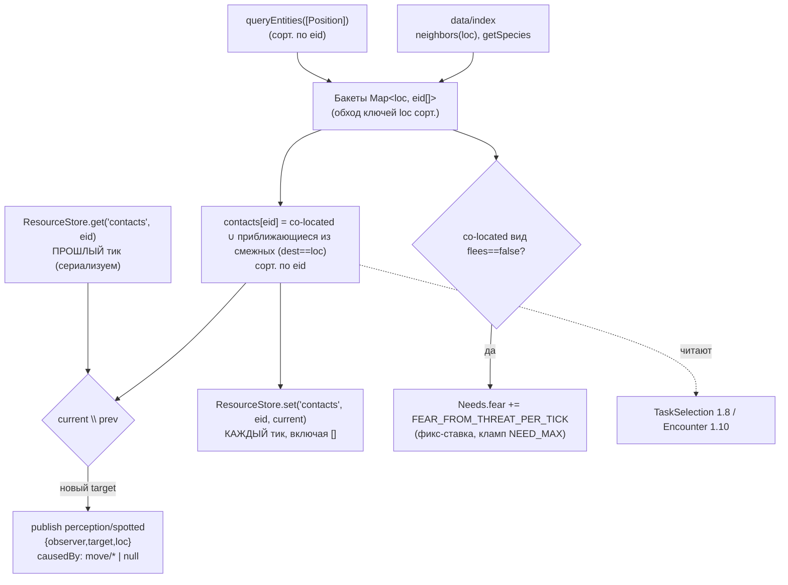

# Задача 1.7 — Perception (видимость + страх)

Система `Perception` (`every:1`) партиционирует носителей `Position` по локациям,
строит `contacts` (COLD, ResourceStore, D-023), публикует `perception/spotted` на
новый контакт и поднимает `Needs.fear` при co-located угрозе (непугливый вид).

## Зависимости и поток тика



## Инварианты

- **Resume-безопасность spotted (P0, закон №8):** «новый контакт» = разность текущих и
  ПРЕДЫДУЩИХ contacts, прочитанных из ResourceStore (сериализуется) ДО перезаписи — не
  из рантайм-Set. Контакты пишутся каждый тик (включая `[]`), устаревший не залипает.
  Подтверждено 6 фазовыми resume-тестами + двойной save/load.
- **n² ограничен бакетом (D-006/D-023):** co-located сравнения только внутри бакета;
  «на подходе» — только в бакетах соседей. O(Σ бакет²) ≪ O(N²).
- **Детерминизм:** обход по сорт. eid и сорт. ключам loc; rng не используется (замечает
  ВСЕХ co-located, не «X% заметить» — закон №2).
- **Причинность:** spotted.causedBy → последнее move/departed|arrived наблюдателя/цели | null.
- **Страх:** бинарно «угроза рядом» (непугливый вид, напр. кабан) → фикс-ставка из balance,
  НЕ ×N; кламп NEED_MAX. Затухание — Needs 1.5.
- **Асимметрия «на подходе»:** наблюдатель в locB видит приближающегося (dest==locB); тот
  видит только свой текущий бакет — осознанно.

## Пример использования

```ts
const sched = createScheduler();
sched.register(Perception);           // после Movement выставит Position, до TaskSelection
sched.tickOnce(world);
const seen = world.resources.get<EntityId[]>('contacts', observerEid) ?? [];
// consumers ОБЯЗАНЫ страховаться existsEntity: contacts могут ≤1 тик держать мёртвый eid (D-029)
```

## Известные ограничения (D-029)

- **Транзиентный мёртвый eid в contacts:** после destroyEntity цель уходит из чужих contacts
  лишь на следующем прогоне Perception; консюмеры валидируют `existsEntity`.
- **Маскировка spotted при reuse eid:** если eid покойника переиспользован новой co-located
  сущностью в межтиковом окне, встреча нового носителя не публикуется (детекция по eid, не
  по идентичности). Редкий случай; принято как ограничение Фазы 1.
