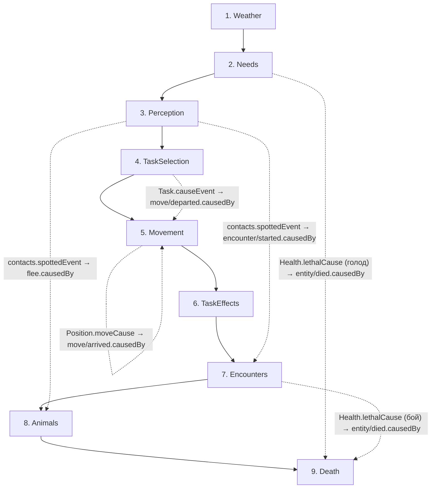
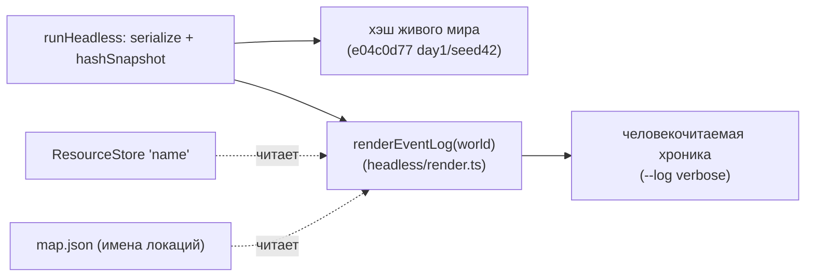

# Конвейер Фазы 1 (1.12) — порядок систем + причинные стыки

`registerPhase1Systems(scheduler)` регистрирует 9 систем в КАНОНИЧЕСКОМ порядке (B.1).
Порядок КРИТИЧЕН (D-032): производитель штампа причины стоит РАНЬШЕ потребителя —
иначе `causedBy` прочитает старое значение (внутритиковая невидимость D-005).
`runHeadless` (headless): `createSimWorld → worldgen → registerPhase1Systems → run`.

## Порядок и стыки причинности (производитель → потребитель)

Инвариант (закреплён `pipeline.test.ts`): Needs<Death, Perception<{TaskSelection,Encounters,Animals},
TaskSelection<Movement, Encounters<Death, Movement<{TaskEffects,Animals}. Weather первой, Death последней.
Реверсивных стыков нет; 4 нарочные перестановки ловятся негативным тестом.

## Презентация (D-006, вне мира)

`renderEventLog` — ЧИСТОЕ чтение (лог/ResourceStore/data), НЕ мутирует мир: хэш с `--log verbose`
и без совпадает (инвариант D-006, покрыт тестом). Тайминг `ms` — только headless, в хэш не входит.

## Голдены
- Живой CLI: `e04c0d77` (day1/seed42, events≈6734), `925aa279` (day100/seed42, events≈215494).
- Core пустого мира `481914ae` (createSimWorld без систем/worldgen) — НЕ трогается (другой путь).

## Хвост здоровья мира (для гейта 1.13 / balance-analyst)
За 10 дней — смертельная спираль (70–80% смертность людей, прей-база вымирает к дню 30):
перевылов (26–49 охот) ≫ приплод (1–3), большинство смертей БОЕВЫЕ (охота на кабанов летальна),
притока/размножения людей нет. Детерминизм/причинность целы — это балансовая проблема (D-043, 1.13).
