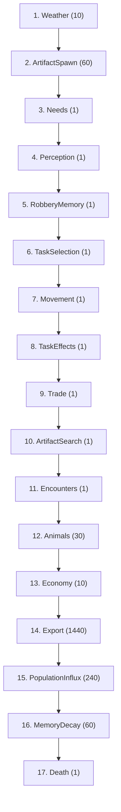
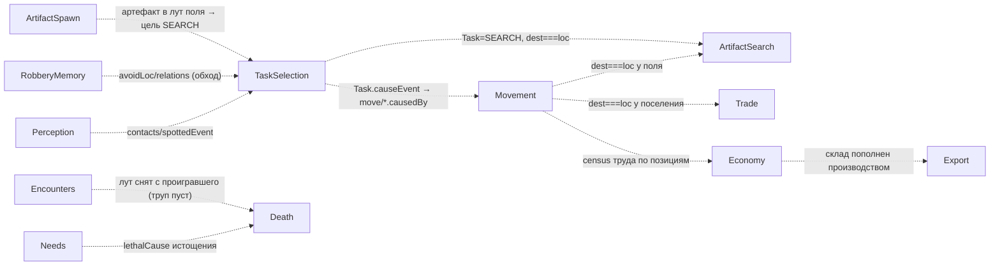

# Конвейер Фазы 2 (2.16a, D-064) — порядок 17 систем + причинные стыки

`registerPhase2Systems(scheduler)` регистрирует 17 систем в КАНОНИЧЕСКОМ порядке.
Расширяет канон Фазы 1 (D-032, 9 систем) семью системами Фазы 2, СОХРАНЯЯ все 8
стыков причинности Фазы 1 и добавляя новые. Порядок КРИТИЧЕН (закон №8): производитель
штампа/компонента стоит РАНЬШЕ потребителя — иначе потребитель прочтёт значение прошлого
тика (внутритиковая невидимость D-005/D-030). `runHeadless` / phase1-gate:
`createSimWorld → worldgen → registerPhase2Systems → run` (единый путь сборки, D-042).
`assignJobs` — НЕ система, вызывается в worldgen (2.16b), в конвейер НЕ входит.

## Порядок исполнения (17 систем)

## Стыки причинности (производитель ⇢ потребитель)

Инвариант (закреплён `pipeline.test.ts` + `phase1-gate.test.ts`):
- **Фаза 1 (сохранены):** Needs<Death, Perception<{TaskSelection,Encounters,Animals},
  TaskSelection<Movement, Movement<{TaskEffects,Animals}, Encounters<Death.
- **Фаза 2 (новые, D-064):** ArtifactSpawn<TaskSelection<ArtifactSearch;
  RobberyMemory<TaskSelection; Movement<{Trade,ArtifactSearch,Economy}; Economy<Export;
  Encounters<Death (лут до трупа, D-060).
- Weather первой (фон среды), Death последней (снимает Alive/Task/Needs с добитых).

## Почему каждая новая позиция там, где стоит

| # | Система | Причина позиции |
|---|---------|-----------------|
| 2 | ArtifactSpawn | физика среды: родить артефакт в лут поля ДО того, как SEARCH его увидит (D-054) |
| 5 | RobberyMemory | реактив `bus.at(tick−1)` на loot/transferred; жертва обновляет обход ДО выбора маршрута (D-063) |
| 9 | Trade | NPC уже стоит у поселения после Movement → сделка у стоящего (D-047/D-056) |
| 10 | ArtifactSearch | NPC уже стоит у поля после Movement → подбор артефакта (D-057) |
| 13 | Economy | census труда по итоговым позициям тика; производство/потребление через леджер (D-045) |
| 14 | Export | вывоз ПОСЛЕ Economy (склад пополнен) — money-faucet item/exported (D-055) |
| 15 | PopulationInflux | читает ЗАКРЫТОЕ окно лога (прошлые тики) → поздно в тике (D-061) |
| 16 | MemoryDecay | обслуживание сознания (затухание/prune), порядок с соседями не критичен (D-058) |

## Голдены (сдвинулись ЗАКОННО, D-064)
- Живой CLI: day1 seed42 `165688eb → 675e1485` (events 11170); day100 sim:100days
  `37a19d72 → 626a8329` (events 91655). Сдвиг: оживают Economy (upkeep/производство
  поселений через леджер), Trade (реальные сделки — конс. перевод), приток
  PopulationInflux (item/broughtIn). Поля/бандиты ещё не в worldgen (2.16b) ⇒
  ArtifactSpawn/ArtifactSearch/Export/RobberyMemory/MemoryDecay ДРЕМЛЮТ.
- Пустой мир `481914ae` (createSimWorld без сущностей) — НЕ трогается: нет носителей ⇒
  все 17 систем no-op; голден идёт от `serialize` пустого мира, не от конвейера.
- **EconomyInvariant (D-045) держится ВЕСЬ 100-дневный прогон** (runHeadless сверяет
  массу с леджером раз в игровой день и НЕ бросает): Economy производит/потребляет через
  леджер, Trade/ArtifactSearch — консервативные переводы, приток — item/broughtIn.
