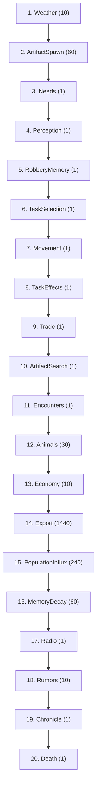
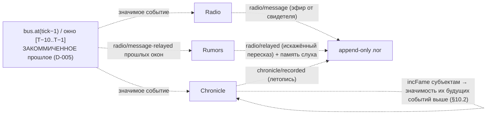

# Конвейер Фазы 3 (3.7, D-074) — 20 систем: канон Фазы 2 + нарративный блок

`registerPhase3Systems(scheduler)` регистрирует 20 систем в КАНОНИЧЕСКОМ порядке: КАПСТОУН
Фазы 3 подключает нарративный блок **Radio → Rumors → Chronicle** в живой конвейер, ПОСЛЕ
`MemoryDecay` и ДО `Death`. Расширяет канон Фазы 2 (D-064, 17 систем), СОХРАНЯЯ все стыки
причинности Фазы 1 (D-032) и Фазы 2 (D-064). Все три нарративные системы — РЕАКТИВЫ на
ЗАКОММИЧЕННОЕ прошлое (`bus.at(tick−1)` / окно `[T−10..T−1]`, D-005), поэтому позиция блока
в тике НЕ критична для причинности его входа; порядок канонический. `runHeadless` / CLI:
`createSimWorld → worldgen → registerPhase3Systems → run` (единый путь сборки).

## Порядок исполнения (20 систем)

## Нарративный блок и fame-петля

## Стыки причинности нарративного блока (D-074)

Инвариант (закреплён `pipeline.test.ts` + `phase1-gate.test.ts`):
- **Фаза 1 (сохранены):** Needs<Death, Perception<{TaskSelection,Encounters,Animals},
  TaskSelection<Movement, Movement<{TaskEffects,Animals}, Encounters<Death.
- **Фаза 2 (сохранены, D-064):** ArtifactSpawn<TaskSelection<ArtifactSearch;
  RobberyMemory<TaskSelection; Movement<{Trade,ArtifactSearch,Economy}; Economy<Export.
- **Фаза 3 (нарратив, D-074):** MemoryDecay<Radio<Rumors<Chronicle<Death.
- Weather первой (фон среды), Death последней (снимает Alive/Task/Needs с добитых).

## Почему нарративный блок стоит ПОЗДНО и ДО Death

| # | Система | Причина позиции |
|---|---------|-----------------|
| 17 | Radio | реактив `bus.at(tick−1)`: живой Human-свидетель озвучивает значимое событие прошлого тика (D-070). ДО Death — павший-этим-тиком ещё живой очевидец |
| 18 | Rumors | реактив окна `bus.at([T−10..T−1])`: слышащие пишут память слуха, болтуны ретранслируют с искажением (D-073). ПОСЛЕ MemoryDecay — свежий слух не под decay того же тика |
| 19 | Chronicle | реактив `bus.at(tick−1)`: значимое → chronicle/recorded + incFame субъектам (ЗАПУСК fame-петли §10.2, D-068) |

Позиция блока НЕ критична для причинности входа (все три читают ЗАКОММИЧЕННОЕ прошлое, не
текущий тик ⇒ петли нет); канон Radio→Rumors→Chronicle перед Death — нарративный поток
«эфир → молва → летопись», фиксирующий события тика ДО смертей текущего тика.

## Голдены (сдвинулись МАССИВНО, D-074) и инварианты

- Живой CLI: day1 seed42 `3c54d141 → f554331d` (events 13027 → 14794); day100 sim:100days
  `fd0bec10 → 561cc138` (events 532278 → 601468). Сдвиг: нарратив заполняет лог
  (radio/message, radio/relayed, chronicle/recorded) и Chronicle копит fame. ~692
  нарративных событий/день за 100-дневный прогон.
- **МИР ПОВЕДЕНЧЕСКИ ТОТ ЖЕ:** нарратив читает закоммиченное прошлое и пишет ТОЛЬКО ключи
  `fame`/`memory` (дизъюнктные positions/inventory/Alive/relations) ⇒ траектория физики
  тождественна Фазе 2. Доказательство: счётчик perception/spotted день-1 seed42 идентичен
  на обоих конвейерах — 9217.
- Пустой мир `481914ae` (createSimWorld без сущностей) — НЕ трогается: нет носителей ⇒
  все 20 систем no-op (нарратив читает пустое окно / нет наблюдателей).
- **EconomyInvariant (D-045) держится ВЕСЬ прогон:** нарратив массу НЕ творит
  (chronicle/recorded/radio/message/radio/relayed — не леджер item/*; incFame/addMemory
  двигают fame/memory, дизъюнктные money/inventory). runHeadless сверяет массу с леджером
  раз в игровой день и НЕ бросает.
- **Детерминизм/resume:** выбор шаблона Radio и искажение Rumors — чистая fnv стабильных id
  (НЕ rng-поток), состояния системы не держат ⇒ два прогона одного seed идентичны;
  resume≡continuous (fame + память слухов + реактивы переживают save/load).

## ⚠ ПЕРФ-ФЛАГ (D-074, для balance-analyst)

sim:100days ЗАМЕДЛИЛСЯ КАТАСТРОФИЧЕСКИ: **~70с (Фаза 2) → ~650с (Фаза 3)**. Это НЕ баг скана
лога (Radio/Rumors/Chronicle читают `bus.at(...)` по индексу, O(тик)), а БАЛАНС/ЁМКОСТЬ: на
плотном старте (хаб Кордон, ~20 co-located болтливых сталкеров) ретрансляция Rumors
КОМБИНАТОРНА (radio/relayed 68558/100дн), а rumor-память (salience 0.05..0.45, MemoryDecay
every:60) прунится МЕДЛЕННЕЕ, чем копится ⇒ массив памяти растёт без границы (memMax ~26k
записей/NPC к дню 6, ~38k к дню 8), а `addMemory` перестраивает+сортирует его на каждую
вставку → квадрат. Лечится БАЛАНСОМ (порог RADIO/CHRONICLE, кламп «сообщений на loc за тик»,
кап памяти в MemoryDecay, скорость затухания слуха) — НЕ логикой нарратива (закон №6). Пока
не оттюнено: прогон ЗАВЕРШАЕТСЯ, таймаут тяжёлого теста поднят презентационно (D-006).
Ре-базлайн голденов D-074 — ПОСЛЕ балансового тюнинга.
