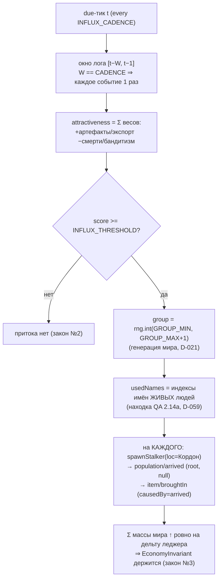

# PopulationInflux 2.14 — причинный приток населения (D-061)

Задача 2.14: система `PopulationInflux` (`every: INFLUX_CADENCE`) — ПРИЧИННЫЙ
приток одиночек из-за Периметра. Закрывает демо-петлю Фазы 1 (D-043 «спираль
смерти»: без притока естественная убыль вымаривает мир). Приток — ПОРОГ по
состоянию мира, НЕ «X% спавн/тик» (закон №2). НЕ в конвейере Фазы 1 (подключит
2.16) ⇒ голдены (sim:100days `37a19d72`, пустой мир `481914ae`) неизменны.

## Зависимости модуля

```mermaid
graph TD
  PI["systems/population-influx.ts (2.14)"]

  PI -->|queryEntities / hasComponent / existsEntity| ECS["core/ecs"]
  PI -->|теги Human/Alive| COMP["core/components"]
  PI -->|bus.log окно / publish| BUS["core/events<br/>(причинность, закон №6)"]
  PI -->|spawnStalker (D-059)| WG["worldgen<br/>единая точка рождения NPC"]
  PI -->|NAMES (имя→индекс)| DATA["data/index (закон №10)"]
  PI -->|ctx.rng fork (размер группы)| RNG["world.rng<br/>(генерация мира, D-021)"]
  PI -->|веса/порог/окно/группа| BP["balance/population<br/>W_* / INFLUX_THRESHOLD / *_CADENCE / GROUP_*"]
  PI -->|loc/фракция/деньги/инвентарь| BW["balance/worldgen<br/>ENTRY_LOCATION / STARTING_*"]

  PI -. эмитит .-> EV1["population/arrived (causedBy=null)"]
  PI -. эмитит .-> EV2["item/broughtIn (causedBy=arrived)<br/>ЛЕДЖЕР источника «из-за Периметра», D-045"]
  PI -. экспорт System .-> IDX["@zona/sim index (headless-инвариант 2.14)"]
```

## Поток решения (один due-тик)



## attractiveness — формула и веса (balance/population)

```
attractiveness =
    W_ARTIFACT_SPAWNED(3)  · #artifact/spawned
  + W_ARTIFACT_COLLECTED(4)· #artifact/collected
  + W_EXPORT(2)            · #item/exported
  − W_DEATH(2)             · #entity/died
  − W_BANDITRY(3)          · #encounter/started(человек-vs-человек)
```

Притягивают: находка/подбор артефакта, экспорт хабара за Периметр (кто-то поднялся
и вывез добро). Отталкивают: волны смертей, бандитские грабежи человек-vs-человек
(критерий: люди по ОБЕ стороны стычки; охота человек-vs-зверь НЕ считается — SEAM
для цепочки бандитов 2.11–2.13, спец-кода при подключении не потребуется).

Окно == шаг (`INFLUX_WINDOW_TICKS == INFLUX_CADENCE`): оценки смотрят на
непересекающиеся стыкующиеся отрезки лога, поэтому одно событие учитывается ровно
один раз (иначе один артефакт тянул бы новичков каждый шаг — взрыв населения;
guard-канарейка в системе падает при рассинхроне констант).

## Инварианты (законы 1–10)

- **№1** приток из СОБЫТИЙ мира, вход в ENTRY_LOCATION (Кордон), НЕ «возле игрока».
- **№2** причинный порог; rng — только размер группы/личность (категория генерации).
- **№3** новичок и его добро приходят С ИСТОЧНИКОМ: `item/broughtIn` на каждую
  единицу инвентаря + деньги ⇒ EconomyInvariant держится (Σ массы ↑ == дельта леджера).
- **№4** новичок с непустыми имя+фамилия, без Task (TaskSelection назначит, D-020).
- **№6** `population/arrived.causedBy=null` (агрегат окна — корень); `item/broughtIn.causedBy`
  = id прибытия; `reason` объясняет решение (D-030).
- **№7** все веса/порог/окно/группа — в `balance/population.ts`.
- **№8** окно проходится в порядке публикаций (стабилен); usedNames — обход по eid;
  без хранимого таймера ⇒ resume ≡ continuous (лог переживает save/load).
