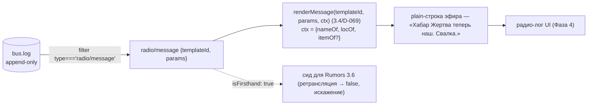

# Задача 3.5 — Radio (радио-сообщения из событий) (D-070)

РАДИО-ЭФИР — СЕРДЦЕ МИРА (GDD §8.1): значимые события мира ОЗВУЧИВАЮТСЯ их **наблюдателями**.
Сообщение = **событие + наблюдатель + окраска характером** говорящего. Radio НЕ выдумывает
событий (закон №1) — реагирует на факт в логе. Реактив на закоммиченный прошлый тик (закон №6,
как Chronicle D-068 / RobberyMemory D-063). В конвейер до 3.7 НЕ подключена (батч сдвига голденов
вместе с Chronicle 3.2 / Rumors 3.6). Строку НЕ хранит (закон №5) — несёт `templateId + params`;
plain-строку собирает `renderMessage` (3.4/D-069) на чтении.

## Тик: реактивная озвучка (bus.at(tick−1))

```mermaid
flowchart TD
  PREV["bus.at(tick−1)<br/>ЗАКОММИЧЕННЫЕ события прошлого тика (D-005)"] --> JAMG{"погода среды глушит?<br/>WorldClock.weather ∈ RADIO_JAMMING_WEATHER"}
  JAMG -->|да (гроза)| SILENCE["тишина всего тика — помехи (§8.1); потеря, не искажение"]
  JAMG -->|нет| LOOP{"для каждого ev<br/>(кроме radio/message, chronicle/recorded — страж от петли)"}
  LOOP --> SIG["significance(ev, world)<br/>чистая функция 3.1 / D-067"]
  SIG -->|"< RADIO_THRESHOLD"| SKIP["пропуск — рутина мимо эфира"]
  SIG -->|">= RADIO_THRESHOLD (balance/narrative, закон №7)"| LOC["ЛОКАЦИЯ события<br/>payload.loc | Position участника"]
  LOC -->|неопределима| SKIP2["тишина (некуда слать наблюдателя)"]
  LOC --> SPK["ГОВОРЯЩИЙ = min-eid ЖИВОЙ Human в loc,<br/>НЕ жертва (nonSpeakers), queryEntities сорт. по eid"]
  SPK -->|нет наблюдателя| SILENCE2["тишина (закон №1 — некому в эфир)"]
  SPK --> TPL["temperament = temperamentCode(speaker) (D-071)<br/>index = fnv1a('eventId:speakerEid') mod poolSize (D-070)<br/>templateId = eventType|temperament|index"]
  TPL --> PARAMS["params = {speaker, subject?, loc, count?, item?}"]
  PARAMS --> PUB["publish radio/message<br/>{speakerEid, subjects: Subject[], loc, templateId, params, isFirsthand: true}<br/>causedBy = ev.id (D-030)"]
```

## Read-time: сборка строки эфира (закон №5 — текст, не DOM)



## Инварианты (законы 1–10)

- **Закон №1 (без игрока)**: эфир пишется наблюдателями мира. Игрок исчез — сталкеры всё равно
  переговариваются. Нет живого свидетеля в локации события ⇒ сообщения нет (тишина — тоже сообщение).
- **Закон №2 (причинность, без rng)**: гейт `significance >= RADIO_THRESHOLD` и выбор говорящего
  (min-eid живой Human в loc, не жертва) выводятся из состояния мира; выбор шаблона — чистая
  `fnv(eventId, speakerEid)`, НЕ «X% шанс»/rng-поток.
- **Закон №3 (не масса)**: `radio/message` — нарративное событие; система вообще не мутирует
  состояние мира (только шину) ⇒ EconomyInvariant (D-045) не видит и не затронут.
- **Закон №5 (headless, не DOM)**: событие несёт `templateId + params`, НЕ строку/HTML; строку
  собирает чистый `renderMessage` на чтении. Никакого импорта из DOM/React.
- **Закон №6 (шина, не прямой вызов)**: читает `bus.at(tick−1)`, ничего не зовёт напрямую;
  `causedBy = ev.id` линкует сообщение на озвученное событие.
- **Закон №7 (константы в balance)**: `RADIO_THRESHOLD` (0.2) и `RADIO_JAMMING_WEATHER` (`['storm']`)
  — в `balance/narrative.ts`; FNV-константы — часть хеш-алгоритма (как в core/rng), не баланс.
- **Закон №8 (детерминизм / resume)**: обход событий по id; субъекты dedup+sort; `templateId` =
  чистая fnv стабильных id (resume-safe, порядко-независима — НЕ mutable rng.fork). Система состояния
  не держит ⇒ save/load ≡ непрерывный прогон автоматически.
- **Помехи погодой (§8.1)**: гроза (`WorldClock.weather ∈ RADIO_JAMMING_WEATHER`) глушит эфир —
  сообщения теряются. Детерминировано из состояния Weather, не rng. Политика «потеря, не искажение»
  (искажение — забота Rumors 3.6).
- **Нет петли эфира**: `significance('radio/message') = UNKNOWN_WEIGHT` (0.0) < порога + явный страж
  `ev.type === 'radio/message'` ⇒ реплика не порождает реплику о реплике.
- **Изоляция / голдены**: система НЕ в конвейере до 3.7 ⇒ голдены Фазы 3 не двигаются (sim:100days
  `fd0bec10` — подтверждено прогоном; пустой мир `481914ae` цел — тест).

## isFirsthand — шов для Rumors 3.6

`isFirsthand: true` (лично воспринято) отличает ПЕРВИЧНЫЙ эфир от будущего СЛУХА: Rumors 3.6
ретранслирует услышанное с `isFirsthand: false` (ошибка наблюдения, искажение при пересказе,
доверие к источнику). Форма замёрзла в контракте `radio/message` для 3.6.
