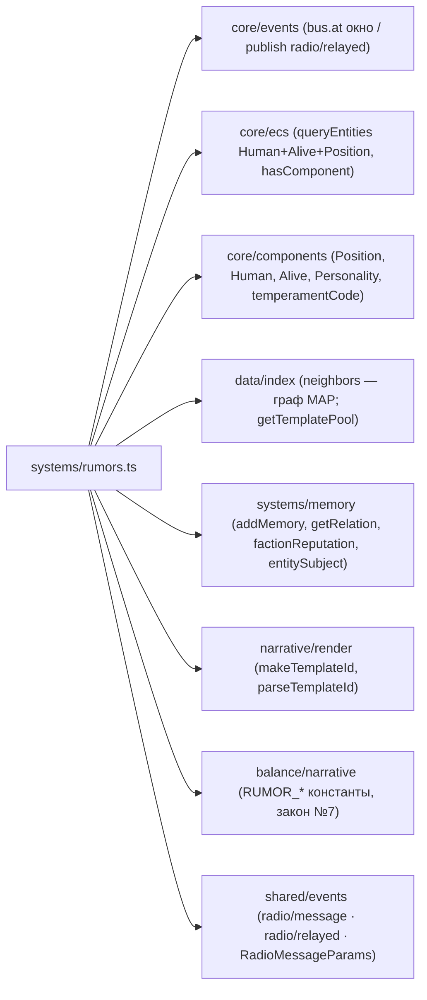

# Rumors (задача 3.6, D-073) — слухи: ретрансляция + искажение + память слуха

Система `Rumors` замыкает нарративный хребет Фазы 3: услышанный эфир
(`radio/message`/`radio/relayed`) расходится молвой. Слух — УТВЕРЖДЕНИЕ о мире, а НЕ факт
(`isFirsthand=false`): слушатель помнит его слабее личного наблюдения, доверяет источнику
по-разному, а болтливый слушатель пересказывает дальше с ИСКАЖЕНИЕМ («двое»→«отряд»→«банда»).

- РЕАКТИВ на ОКНО каденции `bus.at([T−RUMOR_CADENCE .. T−1])` (закон №6, §5.1 «каждые 10 тиков»);
  каденция = размер окна ⇒ каждый тик читается РОВНО раз, пересказ лагает ≥1 тик (P4).
- Слышащие = живые Human в локации вещания + СОСЕДНИХ (граф MAP), кроме говорящего.
- Искажение ДЕТЕРМИНИРОВАНО ЧИСТОЙ `fnv(sourceMessageId, relayerEid, hop)` — БЕЗ rng-потока
  (D-073, как выбор шаблона Radio D-070): resume-safe, порядко-независимо.
- НЕ в конвейере до 3.7 (изоляция): голдены Фазы 3 не двигаются, EconomyInvariant не затронут.

## Поток обработки одного сообщения

```mermaid
flowchart TD
  WIN["ОКНО bus.at([T−CADENCE .. T−1])<br/>закоммиченные radio/message · radio/relayed (D-005)"] --> LOOP{"для каждого сообщения M<br/>(говорящий S, loc вещания L, hop)"}
  LOOP --> HEAR["слышащие = живые Human в L ∪ neighbors(L),<br/>кроме S (queryEntities сорт. по eid, №8)"]
  HEAR -->|нет слышащих| SILENT0["тишина (некому услышать, закон №1)"]
  HEAR --> MEM["addMemory(hearer, kind:'rumor', isFirsthand:FALSE,<br/>salience = BASE_RUMOR_SALIENCE × trust,<br/>subject = гл. субъект, causeEvent = M.id) — D-058/D-038"]
  MEM --> TRUST["trust = clamp01(RUMOR_TRUST_BASE + RUMOR_TRUST_SPREAD × signal)<br/>signal = getRelation(hearer→S) + w·factionReputation (2.15)<br/>враг < незнакомец < друг"]
  HEAR --> RELAY{"talkativeness >= RUMOR_RELAY_TALKATIVENESS (D-071)<br/>И hop < RUMOR_MAX_HOP?"}
  RELAY -->|нет| SILENT1["молчун / потолок хопов — молва дальше не идёт"]
  RELAY -->|да| DIST["ИСКАЖЕНИЕ fnv(M.id, relayer, hop+1):<br/>• templateId → тон РЕТРАНСЛЯТОРА + fnv-индекс<br/>• count раздут монотонно (компаунд по цепочке)<br/>• speaker → relayer; subject/loc стабильны"]
  DIST --> PUB["publish radio/relayed<br/>{speakerEid: relayer, sourceMessageId: M.id, hop+1,<br/>loc: локация relayer, templateId, params, isFirsthand:false}<br/>causedBy = M.id (D-030)"]
  PUB -.след. окно T+CADENCE.-> WIN
  PUB -.read-time.-> RENDER["renderMessage(templateId, искажённые params)<br/>→ plain-строка слуха (3.4, закон №5)"]
```

## Зависимости модуля


