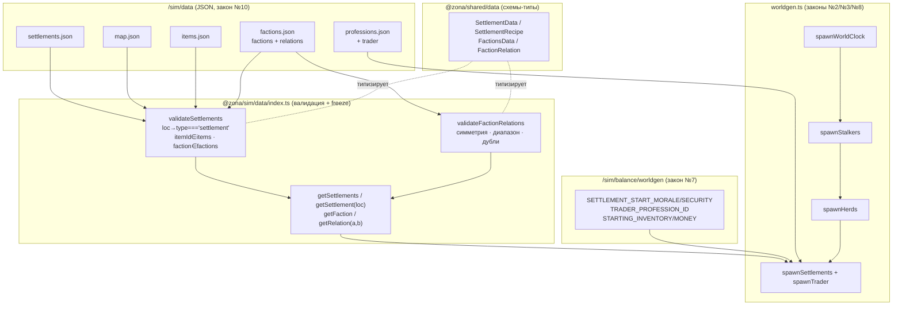
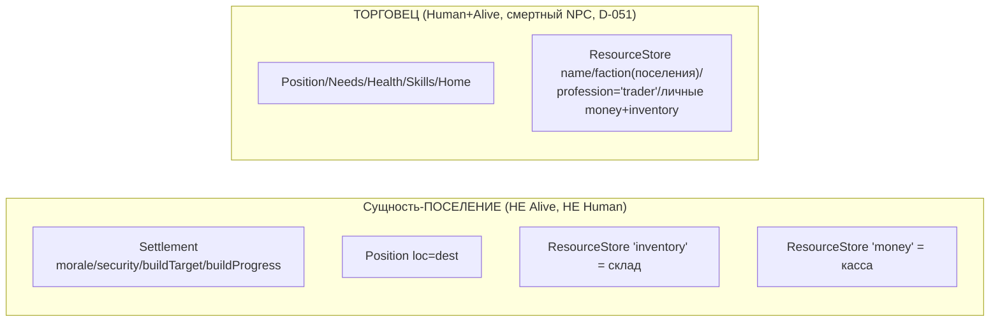

# Задача 2.2 — Поселения / склады / трейдеры / 4 фракции

Расширение worldgen: контент поселений и фракций (закон №10) + детерминированная
материализация поселений, складов, касс и торговцев (законы №2/№3/№8).

## Что добавлено

- `data/settlements.json` — 2 поселения: **Кордон** (loc 0, фракция `loners`) и
  **Бар «Росток»** (loc 5, фракция `duty`). Поля: `shelterBase`, `consumption`,
  `recipes`, `buildQueue`, `startingWarehouse`, `startingTreasury`.
- `data/factions.json` — 4 фракции (`loners`/`military`/`duty`/`bandits`) + матрица
  `relations` (симметрична, [−100..+100]; напр. `duty↔bandits = −100`).
- `data/professions.json` — добавлена профессия `trader`.
- worldgen: сущность-поселение (Settlement+Position) со складом/кассой + смертный
  торговец-NPC на каждом поселении.

## Источник данных (закон №10) → потребители

## Порядок worldgen и детерминизм (закон №8)

`rng = world.rng.fork('worldgen')` потребляется строго:
**мир → сталкеры → стада → поселения+торговцы**. Поселения/торговцы генерируются
**ПОСЛЕДНИМИ** — так добавление Фазы 2 НЕ сдвигает поток rng Фазы 1: сталкеры и стада
получают тождественные прежним eid/имена/позиции/стада; новыми оказываются лишь
сущности-поселения и торговцы, дописанные в конец. (Живые голдены сменились —
см. ниже — потому что в снапшоте появились новые носители, а во время симуляции
2 лишних актёра-торговца сдвигают общий поток `world.rng`.)

## Раскладка сущностей (D-046)

Склад ('inventory') и касса ('money') поселения — под теми же ключами ResourceStore,
что у NPC/трупов ⇒ автоматически учитываются `EconomyInvariant` (D-045/D-046).

## Закон №3 — источник массы (D-021/D-045)

Стартовый склад и касса поселения ФИЗИЧЕСКИ внесены **из-за Периметра** при основании
— это **БАЗЛАЙН t0** экономики, а не эмиссия из воздуха: worldgen НЕ эмитит леджер для
них. `EconomyInvariant.baseline = worldTotals(world)` снимается сразу ПОСЛЕ worldgen,
поэтому склады/кассы входят в базлайн, и инвариант `now − baseline == ledgerDelta`
держится (проверено на 100 днях — `sim:100days` не бросает предохранитель).

Склады НЕ содержат `meat` — мясо по-прежнему появляется только с туш (охота), что
сохраняет инвариант Фазы 1 «meatStart == 0».

## Итоговые числа (seed 42, post-worldgen)

- Сущности: 22 Human (20 сталкеров + 2 торговца) · 33 животных · 2 поселения ·
  1 WorldClock. Alive = 55 (поселения не Alive).
- Базлайн массы: `money = 79000` (35000 кассы + 4000 торговцы + 40000 сталкеры);
  `ammo_9mm = 1152`, `canned = 114`, `bread = 55`, `water = 112`, `bandage = 99`,
  `pm = 30`; `meat = 0`.

## Голдены (сменились — новые носители + сдвиг world.rng)

| Прогон | Было | Стало |
|---|---|---|
| CLI day1 / seed42 (`smoke`) | `cb104eca` | `70e9e546` |
| CLI day100 / seed42 (`sim:100days`) | `84359104` | `ee2ef84c` |
| Core пустого мира (`createSimWorld` без worldgen) | `481914ae` | `481914ae` (НЕ тронут) |
