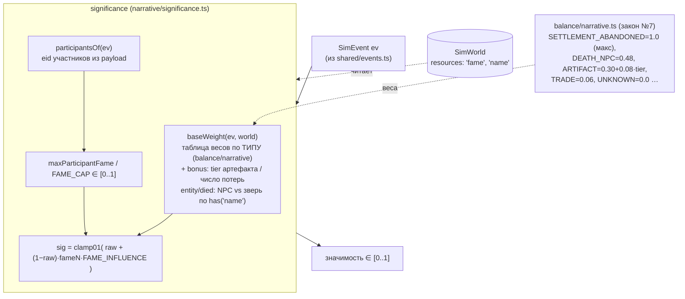

# Задача 3.1 — Значимость события + известность (fame) (D-067)

ФУНДАМЕНТ нарративного хребта Фазы 3: чистая оценка ЗНАЧИМОСТИ события `significance(ev, world)`
∈ [0..1] + хранимый аккумулятор ИЗВЕСТНОСТИ `fame`. НЕ система (в конвейер не входит, worldgen
не зовёт, `fame` в 3.1 нигде не инкрементится). Живёт в НОВОЙ папке `packages/sim/src/narrative/`
(аналог `systems/`, но без побочных эффектов). Позовут Chronicle 3.2 и Radio 3.5.

## Поток данных значимости (ЧИСТАЯ DERIVED функция, без rng, без скана лога)



## Известность fame (хранимый аккумулятор, НЕ derived-из-лога)

```mermaid
flowchart LR
  CHR["Chronicle 3.2 / Radio 3.5<br/>«упомянут в записи/эфире»"] -->|каузальный шаг (НЕ в 3.1)| INC["incFame(resources, eid, delta)"]
  INC -->|МОНОТОННО, кламп [current, FAME_CAP]<br/>новым значением resources.set (D-035)| FKEY[("ResourceStore 'fame'<br/>число на eid")]
  FKEY -->|getFame (нет записи → 0)| SIG2["significance: масштаб по fame"]
  FKEY -.автосериализуется как money (D-050/D-007).-> SNAP["serialize / deserialize"]
```

## Инварианты (законы 1–10)

- **Закон №2/№8**: `significance` детерминирована, БЕЗ rng, из состояния мира (не «X% значимости»).
- **Закон №5**: чистые функции, без DOM/React.
- **Закон №7**: все веса — в `balance/narrative.ts`, в коде магических чисел нет.
- **Перф (D-006)**: `significance` НЕ сканирует лог; `fame` — ХРАНИМЫЙ ключ (скан лога был бы
  квадратом за прогон). Читает только `ev` + O(участников) чтений `fame`.
- **EconomyInvariant (D-045) не затронут**: `'fame'` — репутационное число, ДИЗЪЮНКТЕН
  `'money'`/`'inventory'` (чекер их суммирует, `fame` не видит).
- **Голдены Фазы 3 целы**: система не в конвейере, worldgen не зовёт, `fame` не инкрементится
  ⇒ sim:100days `0eb70da4`, пустой мир `481914ae` не сдвинуты (подтверждено прогоном).
- **Изоляция «упоминание → fame↑»**: сам инкремент в 3.1 к тику НЕ подключён — 3.1 даёт
  ФУНКЦИЮ+контракт; Chronicle 3.2 / Radio 3.5 позовут `incFame` каузальным шагом.
