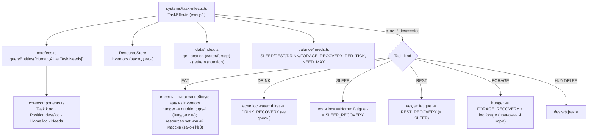

# TaskEffects (1.8e) — исполнение задач: восстановление нужд

Система `TaskEffects` (`every:1`) исполняет ВЫБРАННУЮ задачу у СТОЯЩЕЙ сущности
(`Position.dest===loc`, D-019): EAT/DRINK/SLEEP/REST/FORAGE восстанавливают Needs;
EAT физически расходует еду из инвентаря (закон №3). Замыкает цикл с Needs 1.5
(рост ↔ восстановление). HUNT/FLEE эффекта не дают (мясо → Encounter 1.10).

Место в тик-порядке: **после Movement** (сущность уже у цели), **до Encounters**.

## Зависимости и поток

## Инварианты

- **Закон №3 (расход, не создание):** EAT списывает еду из инвентаря (новый массив через `resources.set`, без in-place мутации общей ссылки — изоляция 1.3 сохранена). Вода/собирательство — из СРЕДЫ локации (`loc.water`/`loc.forage`), не предмет → №3 не нарушается.
- **Детерминизм (законы №2/№8):** rng не используется; выбор «питательнейшей» еды — обход инвентаря (сорт. по item) со строгим `>` (тай-брейк = первая); клампы `[0, NEED_MAX]`; resume-safe (Needs в SoA + inventory в ResourceStore сериализуются). Обход `queryEntities` сорт. по eid.
- **D-019:** эффект только у стоящих (`dest===loc`); в пути — нет.
- **Событий нет** (осознанно): расход инвентаря и Needs — состояние, читаемое нисходящими через компоненты/ресурсы; событие без подписчика было бы мёртвой поверхностью (летопись «поел» — Фаза 3+).

## Ставки восстановления (balance/needs.ts)
SLEEP 0.15/тик (fatigue 100 ~667 тиков) · REST 0.06/тик (< сна) · DRINK 20/тик (~5 тиков) ·
FORAGE 0.5×loc.forage/тик · EAT = nutrition предмета (canned 45 / bread 25 / meat 35).

## Хвост для balance/behavior (QA HIGH → фикс в TaskSelection)
«Переедание»: плоский `W.food` в score(EAT) (TaskSelection 1.8) делает EAT выбором даже при
`hunger≈0` → сытый в СУХОЙ локации жжёт запас впустую (потеря ресурса, подрыв экономики еды).
Корень — решение (TaskSelection), не исполнение (TaskEffects исполняет Task верно). Фикс:
гейтить привлекательность EAT голодом (не плоское слагаемое). См. отдельную правку TaskSelection.
