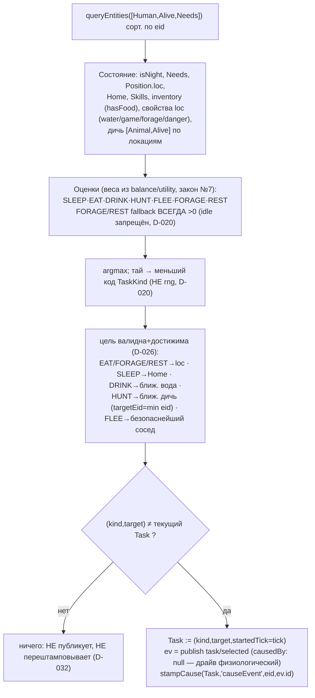

# TaskSelection (1.8) — utility-выбор задачи

Система `TaskSelection` (`every:1`) для каждого живого сталкера считает utility-оценки
задач из СОСТОЯНИЯ (законы №2/№4: причинность, idle запрещён), детерминированным argmax
выбирает задачу, при СМЕНЕ пишет `Task` + публикует `task/selected` + штампует
`Task.causeEvent` (D-030/D-032). Реактивный хаб фазы; производитель штампа для Movement.

## Зависимости

```mermaid
graph TD
  TS["systems/task-selection.ts<br/>TaskSelection (every:1)"]
  COMP["core/components.ts<br/>Needs/Position/Home/Skills/Task/Human/Alive/Animal, TaskKind"]
  ECS["core/ecs.ts<br/>queryEntities/hasComponent/existsEntity/stampCause"]
  DN["systems/daynight.ts<br/>isNight(tick)"]
  PF["systems/pathfinding.ts<br/>nearestLoc/firstStep"]
  DATA["data/index.ts<br/>getLocation/neighbors/getItem"]
  RES["ResourceStore<br/>inventory (hasFood)"]
  BAL["balance/utility.ts<br/>веса W.*, fallback"]
  BUS["world.bus<br/>publish task/selected"]
  EV["@zona/shared/events.ts<br/>task/selected {eid,kind,targetLoc?,targetEid?}"]

  TS --> COMP
  TS --> ECS
  TS --> DN
  TS --> PF
  TS --> DATA
  TS --> RES
  TS --> BAL
  TS --> BUS --> EV
  TS -. штамп Task.causeEvent .-> COMP
  MV["Movement 1.4"] -. читает Task.causeEvent .-> COMP
```

## Поток тика (на сущность)



## Инварианты

- **Idle запрещён (закон №4):** `score(FORAGE)`/`score(REST)` строго >0 при любом состоянии; argmax всегда даёт задачу. Ни одна живая Human-сущность не остаётся без Task.
  - *Контракт (QA-хвост):* система запрашивает `[Human,Alive,Needs]` — живой Human БЕЗ Needs был бы пропущен. worldgen всегда даёт Needs; отсутствие Needs у живого человека ловит world-инвариант гейта 1.13.
- **Детерминизм (законы №2/№8):** rng в решении НЕ используется; тай-брейк по коду enum; обход сорт. по eid; ключи Map сортируются. RESUME-safe: «прошлая задача» = текущее значение компонента `Task` (сериализуется), не рантайм-состояние.
- **Причинность (D-030/D-032):** `task/selected` публикуется/перештамповывается ТОЛЬКО при смене задачи; `Task.causeEvent` = id task/selected → Movement читает O(1). TaskSelection стоит РАНЬШЕ Movement в порядке (штамп виден тем же тиком).
- **Цель (D-026):** всегда валидна и достижима; HUNT только при наличии живой дичи; targetEid из живого запроса (мёртвый eid не адресуется — угроза учитывается через `Needs.fear`, не через contacts, D-029).
- **Веса (закон №7):** все `W.*` и fallback — в balance/utility.ts; тюнинг — balance-analyst.

## Хвосты для balance-analyst / гейта 1.13
- FLEE уводит в наименее опасного СОСЕДА даже если текущая loc безопаснее (кандидат на тюнинг: не бежать в бóльшую опасность).
- Полный суточный цикл замкнётся с задачей 1.8e (восстановление нужд): без неё нужды только растут, популяция тяготеет к SLEEP в лагере.
