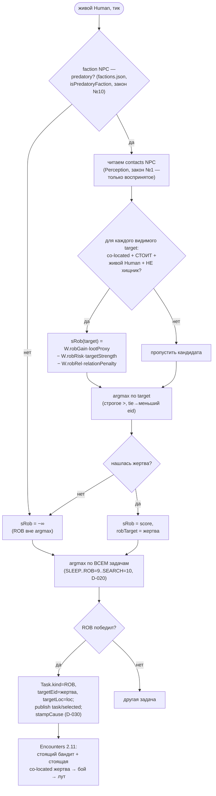
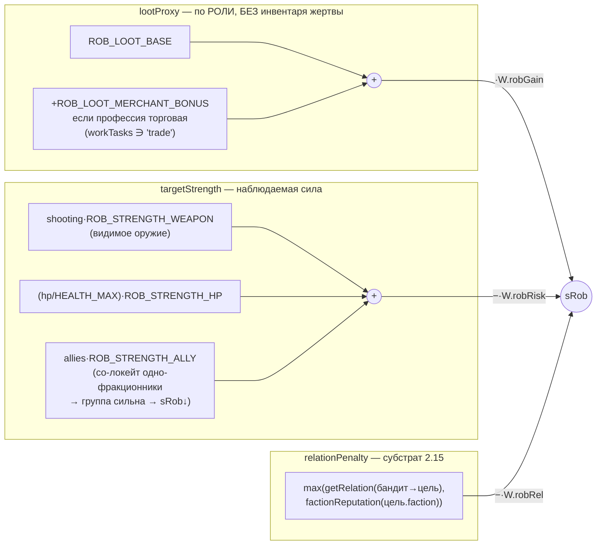

# TaskSelection — выбор ROB (задача 2.12, D-049/D-062)

Как утилити-AI `systems/task-selection.ts` детерминированно ВЫБИРАЕТ грабёж (ROB).
Исполнение боя/лута — Encounters (2.11, D-060). Выбор дремлет, пока в мире нет
акторов хищной фракции (worldgen спавнит 'loners') ⇒ голдены Фазы 1 стабильны.

## Поток решения ROB для одного NPC



## Составляющие sRob (наблюдаемые, анти-чит D-049)



## Инварианты

- Закон №10: хищность — поле `predatory` в factions.json, НЕ хардкод id в коде.
- Закон №1: жертва — из `contacts` (воспринятое), не из глобального состояния мира.
- Анти-чит (D-049): `lootProxyOf` не читает 'inventory' жертвы — оценка по роли; силу
  считает по ВИДИМОМУ оружию/hp/союзникам, не по ценности кармана.
- Эмерджентность: «грабёж одиночек / обход групп» — из `allies·ROB_STRENGTH_ALLY`, без
  спец-кода.
- Закон №8: обходы сортированы (contacts по target, roster по eid), tie→меньший eid;
  rng не участвует.
- Согласование с Encounters 2.11 (D-060): гейт жертвы (co-located + стоит + живой Human
  не-хищник) тождествен условию, при котором encounters.ts завяжет бой.
```
