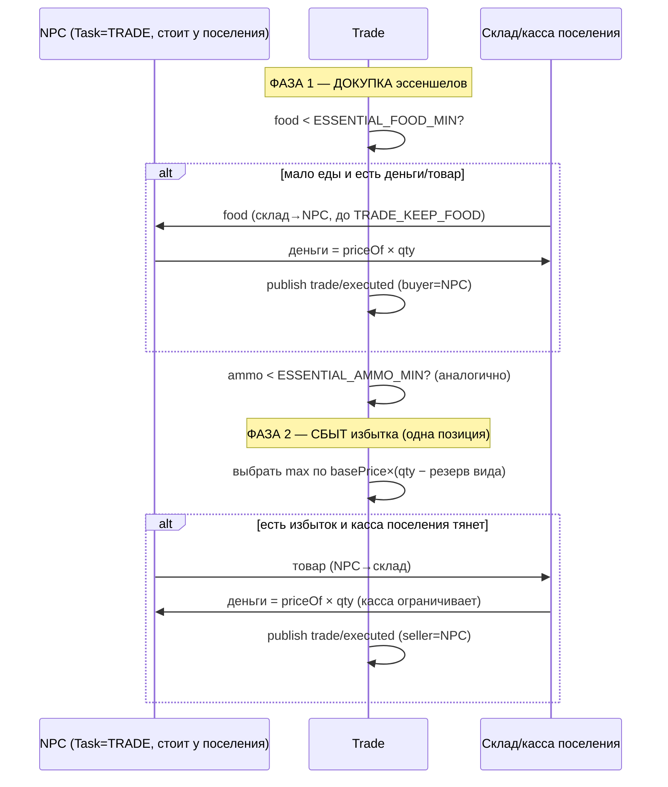

# Trade (2.5) — зависимости, поток и модель сделки

Система **Trade** исполняет сделки между стоящим у поселения NPC (`Task.kind === TRADE`)
и складом/кассой этого поселения. Цена — **DERIVED** (`priceOf`, D-047): чистая
детерминированная функция дефицитности склада (закон №2, не «X% шанс»). Сделка — это
**ПЕРЕВОД** (закон №3): предметы и деньги физически меняют владельца, суммарная масса
мира не меняется, поэтому Trade **не эмитит леджер** `item/*` (EconomyInvariant держится
с денежной/товарной дельтой 0).

## Граф зависимостей

```mermaid
graph TD
  Trade["systems/trade.ts<br/>Trade (every:1)"]
  Pricing["systems/pricing.ts<br/>priceOf(item,stock,target)"]
  DATA["data/index.ts<br/>getSettlement · getItem(basePrice)"]
  BAL["balance/economy.ts<br/>PRICE_* · ESSENTIAL_* · TRADE_KEEP_*"]
  TASK["core/components.ts<br/>Task (kind=TRADE, causeEvent) — чтение"]
  POS["core/components.ts<br/>Position (loc,dest) — чтение"]
  SET["core/components.ts<br/>Settlement — чтение (носитель поселения)"]
  RS["core/world.ts (ResourceStore)<br/>'inventory' / 'money' (D-046)"]
  ECS["core/ecs.ts<br/>queryEntities"]
  BUS["core/events.ts (world.bus)<br/>publish"]
  EV["@zona/shared/events.ts<br/>trade/executed"]

  Trade --> Pricing
  Trade -. читает .-> TASK
  Trade -. читает .-> POS
  Trade -. читает .-> SET
  Trade --> RS
  Trade --> ECS
  Trade --> BUS
  Trade --> BAL
  Trade --> DATA
  Trade --> EV
  Pricing --> DATA
  Pricing --> BAL

  TS26["TaskSelection 2.6<br/>(выбирает Task=TRADE, штампует Task.causeEvent)"] -. пишет .-> TASK
  TASK -. causedBy = Task.causeEvent NPC .-> Trade
```

Trade **не решает, КОГДА торговать** (это 2.6 через выбор задачи) — лишь исполняет при
уже выбранном `Task=TRADE`. Экспорт за Периметр — 2.7; грабёж — 2.12. Trade **не входит**
в `registerPhase1Systems`/worldgen (подключит 2.16), поэтому голдены Фазы 1 не сдвигаются
(подтверждено: 70e9e546 / ee2ef84c / 481914ae неизменны).

## Цена (D-047) — DERIVED, не хранится и не эвентится

```
stockRatio = stock / targetStock            # 1 = «норма»; <1 дефицит; >1 избыток
mult       = clamp(1 + PRICE_ELASTICITY × (1 − stockRatio),
                   PRICE_MULT_MIN, PRICE_MULT_MAX)
price      = max(PRICE_FLOOR, round(basePrice × mult))
```

- **Дефицит** (stock мал ⇒ ratio<1) → mult>1 → цена **выше** basePrice.
- **Норма** (ratio=1) → mult=1 → цена ≈ basePrice.
- **Избыток** (ratio≫1) → mult<1 → цена **ниже** (клампится в `PRICE_MULT_MIN`).
- `mult` монотонно **убывает** по stockRatio ⇒ цена не растёт с запасом.
- Округление до целого держит деньги целочисленными → перевод точен, инвариант сходится.
- `basePrice` — контент (`items.json`, закон №10); эластичность/границы/пол —
  `balance/economy.ts` (закон №7). `targetStock` («норма») Trade берёт из
  `startingWarehouse` поселения (settlements.json), либо `DEFAULT_TARGET_STOCK`.

Цена **не в снапшоте** (resume-safe, как день/ночь из tick, D-019): вычисляется на лету;
`trade/executed` несёт использованную цену лишь для летописи — авторитет всегда пересчёт.

### Ценовые константы (balance/economy.ts)

| Константа | Значение | Смысл |
|---|---|---|
| `PRICE_ELASTICITY` | 0.6 | наклон реакции цены на отклонение склада от нормы |
| `PRICE_MULT_MIN` | 0.25 | нижняя граница множителя (избыток не роняет цену ниже) |
| `PRICE_MULT_MAX` | 3.0 | верхняя граница множителя (дефицит не взлетает выше) |
| `PRICE_FLOOR` | 1 | абсолютный пол цены единицы (закон №3: не даром) |
| `DEFAULT_TARGET_STOCK` | 10 | норма для предмета вне startingWarehouse |

## Модель сделки (детерминированная политика 2.5)

Для каждого NPC (`Human, Alive, Task, Position`; сорт. по eid) с `Task.kind === TRADE`,
**стоящего** (`Position.dest === loc`) в локации **живого** поселения
(`getSettlement(loc)` есть, флаг `settlementAbandoned` не стоит):



- **Порядок фаз** (докупка → сбыт) и выбор позиции детерминированы; **цикла нет**.
- **Не в долг**: покупка ограничена `floor(npcMoney / price)` и наличием на складе;
  продажа — `floor(setMoney / price)` (касса поселения).
- Резерв при продаже по виду: `TRADE_KEEP_WEAPON/FOOD/DRINK/AMMO/MEDICAL` — избыток
  сверх резерва сбывается, эссеншелы на руках сохраняются.

## Причинность и закон №3

- `trade/executed {buyer, seller, item, qty, price, money}` — `causedBy = Task.causeEvent`
  NPC (событие `task/selected`, выбравшее TRADE, D-047/D-030), либо `null`.
- **Перевод атомарен** (D-035): рабочие копии складов-Map мутируются локально, обратно
  пишутся **новыми** массивами через `resources.set` (чужая хранимая ссылка не портится).
- **Масса сохраняется**: снять у одного = добавить другому; Σ денег и Σ каждого itemId
  до и после сделки идентичны ⇒ `ledgerDelta ≡ 0`, `assertEconomyInvariant` держится
  (денежная дельта 0 — Trade не faucet; деньги-faucet только export/broughtIn, D-045).
- **rng не используется** — цена и решение суть функции состояния (законы №2/№8).
```
