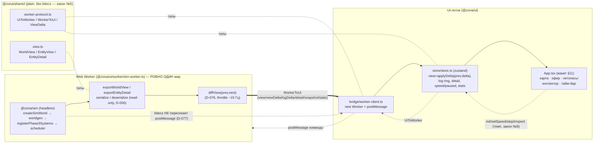

# Worker-мост Sim⇄UI (задача 4.0, D-077/D-078)

ПЕРВЫЙ код интерфейса наблюдателя (Фаза 4). Каркас `@zona/ui`: Vite + React 18 + zustand +
Web Worker. Воркер крутит headless-`@zona/sim` вне UI-потока; наружу через границу
`postMessage` едут ТОЛЬКО plain-виды/дельты `@zona/shared` (закон №5 / D-077). UI-команды
влияют лишь на темп/паузу/шаг/инспекцию — не на содержимое тиков (закон №8). Обновления
идут дельтами с throttle ~15 Гц (D-078).

## Граница postMessage и поток данных



## Дельта-дифф + throttle (D-078)

- `diffView(prev, next)` — ЧИСТАЯ (headless-тестируема): `changed` = новые/изменившиеся
  `EntityView` (сравнение по полям), `removed` = исчезнувшие eid; часы/погода из `next`.
- `applyDelta(base, delta)` реконструирует следующий `WorldView` и ПЕРЕСЧИТЫВАЕТ
  `population` по `kind` (в дельту не входит — производна ⇒ трафик минимален).
- ИНВАРИАНТ (тест): `applyDelta(prev, diffView(prev, next))` deep-equal `next`.
- THROTTLE: воркер экспортирует/шлёт не на каждый sim-тик, а раз в кадр (~15 Гц). При
  ×600 мир идёт сотни тиков/сек, UI обновляется 15 раз/сек дельтами. Первый снимок после
  init — полный `view`, дальше — `viewDelta`.

## Пейсинг темпа и детерминизм (закон №8)

Воркер продвигает `floor(dt × ticksPerRealSecond)` тиков за реальный кадр (`performance.now`
— драйвер ТЕМПА, как замер `ms` в headless-CLI, D-006). Реальное время решает КОЛИЧЕСТВО
тиков, но НЕ содержимое каждого: каждый тик считает тот же seeded-конвейер. «Тот же seed +
тот же номер тика → тот же хэш» держится независимо от пауз/скорости/шага.

## ⚠ Ровно один мир на воркер (заметка 4.1)

SoA-колонки bitecs глобальны на процесс — два `SimWorld` в одном воркере затёрли бы друг
друга. Воркер держит РОВНО ОДИН мир; `init` заменяет его целиком. Нужна вторая симуляция —
второй воркер (свой процесс/поток → своя копия глобальных колонок).

## Изоляция (голдены целы)

4.0 НЕ трогает `/sim`-логику (только читает публичный API). Голдены не сдвинуты:
sim:100days `0f1ef408`, day1 seed42 `429867e2`, пустой мир `481914ae`. UI-пакет не входит в
headless-прогон симуляции; его тесты — чистая логика (delta/протокол) + jsdom-smoke каркаса.
```
