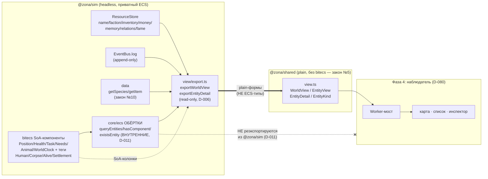
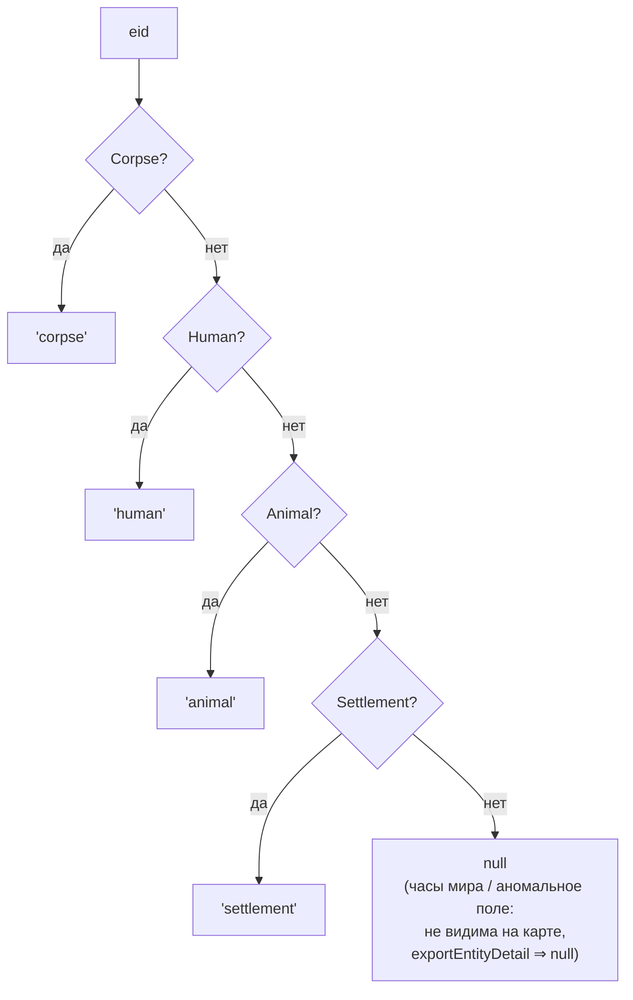
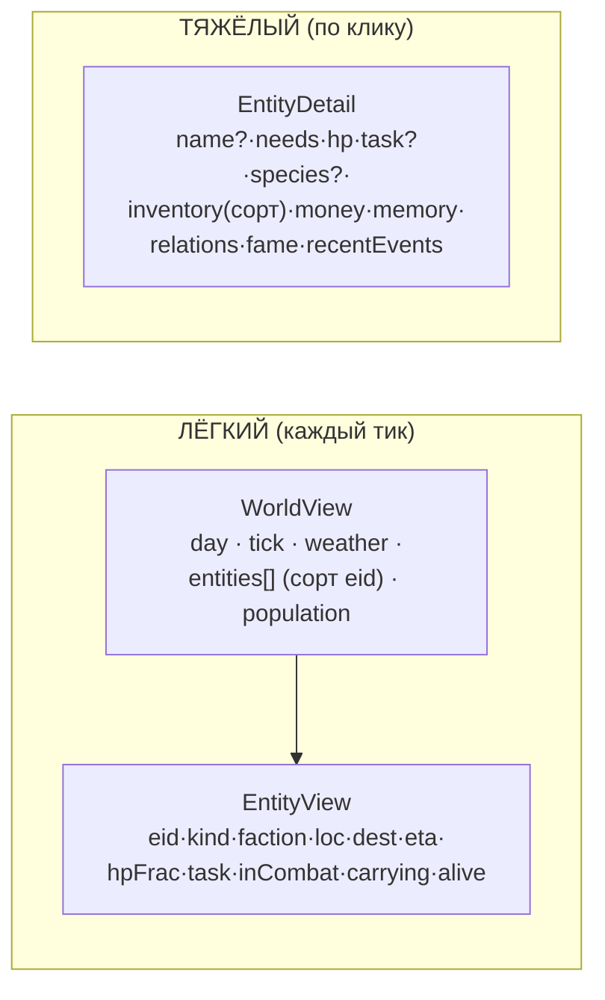

# View-контракт Sim→UI + экспортёры (задача 4.1, D-076)

ФУНДАМЕНТ Фазы 4 (интерфейс наблюдателя). Read-only срез приватного ECS+ResourceStore
в plain-формы `@zona/shared` для Worker-моста и панелей UI. НЕ система, в конвейер тика
НЕ входит (D-080), голдены не двигает; чистое чтение (D-006); ни один bitecs-тип наружу
не течёт (закон №5 / D-011).

## Граница пакетов и поток данных

## Классификация kind (порядок проверки тегов)

`Corpse` проверяется ПЕРВЫМ: мёртвый человек несёт И `Human`, И `Corpse` (Death снимает
`Alive`, вешает `Corpse`, но `Human`-тег остаётся) ⇒ он `'corpse'`, а не `'human'`.

## Два уровня детализации

## Решения полей

- **inCombat** — всегда `false` в 4.1: бой длится РОВНО один тик (`encounter/started`+
  `resolved` в одном тике), персистентного состояния «в бою» на сущности нет. Скан
  `bus.at(tick)` дорог (O(лог) на каждый per-tick экспорт) и неоднозначен (буфер тика ещё
  не закоммичен). TODO Фазы 4: «недавно в бою» из закоммиченного окна encounter-событий.
- **carrying** — есть ли в инвентаре предмет kind `'artifact'` (`getItem`, закон №10).
- **recentEvents** — `participantsOf(ev)` (канон нарратива, D-067) ∪ прямые актёры
  распорядка (`task/selected`/`move/*`); последние 50 (презентационное окно, не balance).
- **hpFrac** = `hp / HEALTH_MAX` клампится [0..1]; без Health (поселение) — `1`.
- **faction** — из ResourceStore `'faction'`; у животных/трупов/поселений записи нет ⇒ `null`.

## Инварианты

- **Закон №5**: `view.ts` зависит только от plain shared-модулей (`./ids`, `./memory`);
  ECS-обёртки читаются внутри `export.ts`, но НЕ реэкспортируются из `@zona/sim` (D-011).
- **D-006**: `hashSnapshot` до == после экспорта (мир не мутирован).
- **D-080 / голдены**: экспортёры не в конвейере/worldgen ⇒ `sim:100days 0f1ef408`,
  пустой мир `481914ae`, day1 seed42 `429867e2` — не сдвинуты.
- **Детерминизм (закон №8)**: обходы сорт. по eid/itemId; два экспорта одного мира deep-equal.
