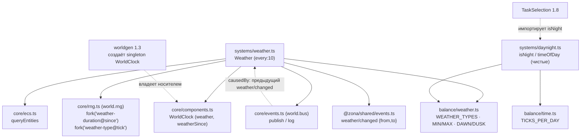

# Weather + день/ночь (1.6) — зависимости и поток

Система Weather меняет погоду СРЕДЫ на singleton-носителе `WorldClock` (марковский
процесс с длительностью). День/ночь — ЧИСТАЯ производная от `tick` (не хранится).

## Граф зависимостей



## Ключевые инварианты

- **rng под закон №2 (D-019):** погода — генерация СРЕДЫ, детерминированная от
  seed, а не «X% исхода у сущности». Идёт даже без единого NPC (закон №1). Поэтому
  seeded PRNG ядра здесь легален (категория «генерация мира»).
- **Resume-безопасность (P0, закон №8):** ничего не хранится в рантайме. Длительность
  текущей погоды = `world.rng.fork('weather-duration@' + weatherSince).int(MIN,MAX)` —
  зависит ТОЛЬКО от сериализуемого `weatherSince` + `seed`, поэтому восстанавливается
  тождественно на любом тике после load. Длительность НЕ зависит от типа (иначе для
  пересчёта пришлось бы знать предыдущий тип, который не хранится). Тип новой погоды
  хранится в `WorldClock.weather`, пересчитывать его после load не нужно.
- **Причинность (закон №6):** `weather/changed.causedBy` → id предыдущего
  `weather/changed` в логе (лог сериализуется ⇒ цепочка переживает save/load), либо
  `null` для первой смены.
- **Singleton:** 0 носителей → no-op; ровно 1 → работа; >1 → throw (баг worldgen).
- **День/ночь не хранится (D-019):** `isNight(tick)` = `tick mod TICKS_PER_DAY`
  относительно `[DAWN_TICK, DUSK_TICK)`. Чистая функция → тривиальный resume.

## Пример

```ts
import { Weather } from '@zona/sim/systems/weather';
import { isNight } from '@zona/sim/systems/daynight';

sched.register(Weather);          // среда меняет погоду от seed
if (isNight(ctx.tick)) { /* ночная логика TaskSelection 1.8 */ }
```
