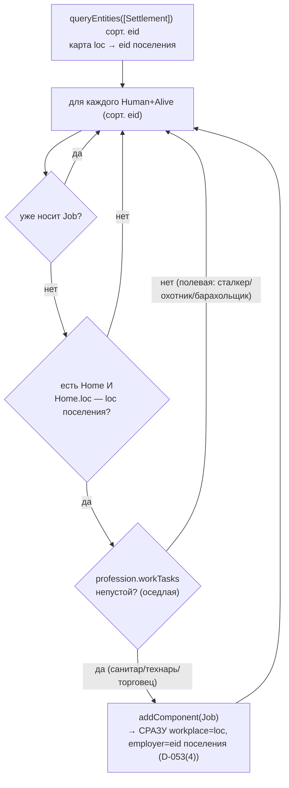

# WORK-задача + наём (2.4) — работники ходят на смену

Задача 2.4 даёт NPC ЭМЕРДЖЕНТНЫЙ рабочий день. Две части:

1. **WORK-выбор** в TaskSelection (1.8): носитель `Job` при спокойных нуждах ДНЁМ
   тянется на рабочее место (`Job.workplace`); любая критическая нужда/страх/ночь
   перебивают смену. Веса — только в `balance/utility` (`W.work`).
2. **assignJobs** (`systems/job-assign.ts`) — детерминированный хелпер найма:
   навешивает `Job(workplace, employer)` резидентам поселений с «оседлой» профессией
   (непустой `workTasks` в `professions.json`).

Обе части НЕ в конвейере/worldgen: `assignJobs` вызовет FactionAI/2.16, до тех пор
носителей `Job` в живом прогоне НЕТ ⇒ WORK-ветка не исполняется, Economy (2.3) видит
0 труда, голдены Фазы 1 (70e9e546 / ee2ef84c / 481914ae) не сдвигаются (закон №8).

## Граф зависимостей

```mermaid
graph TD
  subgraph BEHAVIOR["зона behavior-engineer (2.4)"]
    TS["systems/task-selection.ts<br/>TaskSelection (every:1)<br/>+ WORK-оценка"]
    JA["systems/job-assign.ts<br/>assignJobs(world) — НЕ система"]
  end

  UTIL["balance/utility.ts<br/>W.work (+ W.fatigue/safe/… для конкурентов)"]
  DAYN["systems/daynight.ts<br/>isNight(tick)"]
  COMP["core/components.ts<br/>Job(workplace,employer) · Task(kind,targetLoc,causeEvent)<br/>Settlement · Position · Home · Needs · Human(tag) · Alive(tag)"]
  ECS["core/ecs.ts<br/>queryEntities · hasComponent · addComponent · stampCause"]
  DATA["data/index.ts<br/>getProfession(id).workTasks (professions.json)<br/>getLocation(loc).danger → safety"]
  RES["core/world.ts (ResourceStore)<br/>'profession' (cold string id)"]
  BUS["core/events.ts (world.bus)<br/>task/selected (WORK)"]
  MOVE["systems/movement.ts<br/>читает Task.causeEvent → move/departed.causedBy"]

  TS --> UTIL
  TS --> DAYN
  TS --> COMP
  TS --> ECS
  TS --> DATA
  TS --> BUS
  TS -. штамп Task.causeEvent (D-030) .-> MOVE

  JA --> COMP
  JA --> ECS
  JA --> DATA
  JA --> RES

  ECON["systems/economy.ts (2.3)<br/>труд = Human с Job.employer==поселение"]
  JA -. ставит employer/workplace (D-053(4)) .-> ECON
  FA216["FactionAI / интеграция 2.16 (будущее)"] -. вызовет assignJobs(world) .-> JA
  PIPE["registerPhase1Systems / worldgen"] -. Job НЕ навешивается ⇒ WORK вне живого прогона .-> TS
```

## WORK в utility-argmax (веса — только `balance/utility`)

Оценка задачи-кандидата WORK (добавлена в argmax TaskSelection, код `TaskKind.WORK=7`
— в конце массива, tie проигрывает меньшим кодам):

```
needCalm = max(0, 1 − max(hunger, thirst, fatigue, fear))   // все нужды спокойны?
safety   = 1 − location.danger                              // рабочее место безопасно?
WORK     = (hasJob И день) ? W.work · safety · needCalm : −∞
```

- **−∞ у безработных** (нет `Job`) и **ночью** — WORK исключён из argmax (как EAT без
  еды): поведение не-Job NPC не меняется, ночью работник спит.
- **`needCalm`** гасит WORK к нулю при любой поднявшейся нужде/страхе ⇒ вперёд
  проходят EAT/DRINK/SLEEP/HUNT/FLEE (сначала выжить, потом смена).
- **`W.work=0.5`** подобран так, что спокойный сытый работник днём даёт
  `WORK ≈ 0.475` (Кордон, safety 0.95) — выше дневного SLEEP (0.285), REST (0.1),
  FORAGE (~0.12): эмерджентный «рабочий день» БЕЗ явного расписания (закон №1/№2).
- Цель WORK — `Task.targetLoc = Job.workplace`; уже на месте ⇒ `targetLoc==loc`
  (Movement no-op). Смена задачи публикует `task/selected` и штампует
  `Task.causeEvent` (D-030/D-032) — как прочие задачи.

## assignJobs — критерий и детерминизм



- **Критерий «по профессии», а не «каждый второй»** — причинно связан с фикцией: на
  смену ходит тот, у кого есть рабочее место (оседлая профессия). Полевые профессии
  рабочего места не имеют ⇒ их распорядок дня рождается из нужд (FORAGE/HUNT/рейд,
  D-020) — эмерджентное разделение труда.
- **D-053(4):** `addComponent(Job)` зануляет поля (D-024); `employer`/`workplace`
  выставляются СРАЗУ после add — до того как Economy/census прочитают (иначе ложная
  приписка к eid 0).
- **Детерминизм/идемпотентность:** обход по eid, rng не используется; уже
  трудоустроенные пропускаются ⇒ 2 прогона seed идентичны, повторный вызов стабилен.
- **Масса не двигается** (закон №3): `Job` — компонент-состояние, не предмет; событий
  нет, `EconomyInvariant` не затронут.

## Данные

`professions.json` получил поле `workTasks: string[]` (закон №10 — код оперирует
абстрактными id задач, не семантикой): непустой = оседлая профессия (`medic:["heal"]`,
`mechanic:["repair"]`, `trader:["trade"]`), пустой = полевая (`stalker/hunter/scavenger:[]`).
Валидируется в `data/index.ts` (`validateProfessions`).
