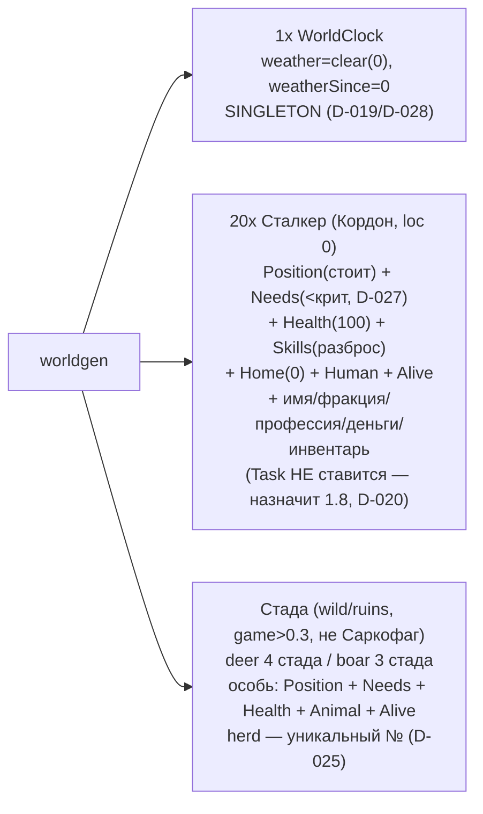

# Worldgen 1.3 — стартовая генерация мира

Задача 1.3: `worldgen(world: SimWorld): void` — вызывается ОДИН раз при сборке
мира (CLI 1.12) до первого тика. Заселяет пустой `SimWorld` детерминированно от
seed (`rng.fork('worldgen')`, D-021). Источник стартового инвентаря — «внесено
из-за Периметра» (D-021, закон №3).

## Зависимости модуля

```mermaid
graph TD
  WG["worldgen.ts (1.3)"]

  WG -->|spawnEntity / addComponent| ECS["core/ecs"]
  WG -->|SoA-компоненты| COMP["core/components<br/>Position/Needs/Health/Skills/Home/Animal/WorldClock<br/>+ теги Human/Alive + WEATHER_CODE"]
  WG -->|холодные данные D-007| RES["world.resources<br/>name / faction / profession / money / inventory"]
  WG -->|rng.fork('worldgen') D-004| RNG["world.rng"]
  WG -->|MAP / NAMES / getSpecies| DATA["data/index<br/>(факции/профессии — контент, закон №10)"]
  WG -->|HEALTH_MAX| BN["balance/needs"]
  WG -->|числа расстановки| BW["balance/worldgen<br/>STALKER_COUNT / STARTING_* / STARTING_HERDS<br/>HERD_MIN_GAME / SKILL_* / ANIMAL_*"]

  WG -. экспорт .-> IDX["@zona/sim index (для CLI 1.12)"]
```

## Что создаётся



## Инварианты (гейт worldgen.test.ts)

- Детерминизм: `worldgen(seed)` дважды → идентичный хэш снапшота (закон №8).
- Сталкер: loc=Кордон; Needs строго < HUNGER/THIRST/FATIGUE_CRITICAL (D-027);
  Health>0; имя с непустыми first И last (закон №4); непустой инвентарь с
  валидными itemId (закон №3); money>=0.
- Ровно 1 WorldClock; никто не в Саркофаге (loc 9); сталкеры в Кордоне.
- Стада: в wild/ruins с game>HERD_MIN_GAME; валидный species+herd; размер стада
  ∈ [herdMin,herdMax]; один вид на стадо.
- RESUME: worldgen → serialize → deserialize → идентичный хэш.
- Число сущностей < WORLD_CAPACITY (для seed=42: 54 = 1 мир + 20 + 33 животных).
