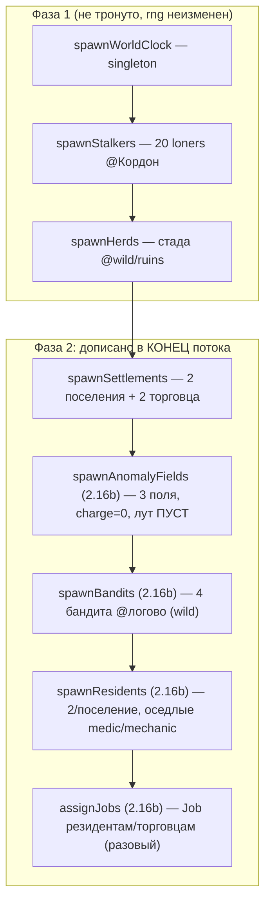

# Оживление worldgen — генезис Фазы 2 (2.16b, D-065)

`worldgen(world)` заселяет пустой мир РОВНО ОДИН РАЗ до первого тика. Задача 2.16b
дописала в КОНЕЦ потока rng носителей ДРЕМЛЮЩИХ систем Фазы 2 (как 2.2 — поселения):
существующие сущности (20 одиночек, стада, поселения, торговцы) БИТ-В-БИТ те же
(их eid/имена/rng не сдвинуты — добавления идут после в потоке `rng.fork('worldgen')`).

## Порядок генезиса (стрелка = порядок в потоке rng)



## Что оживляет каждый носитель (D-065)

```mermaid
graph LR
  AF["AnomalyField (data/anomaly_fields.json)\ncharge=0, tier, лут ПУСТ"] -->|ArtifactSpawn рождает артефакт\nв прогоне (item/harvested)| Loops1["ArtifactSpawn → ArtifactSearch → Export"]
  BA["Бандиты (faction bandits,\npredatory D-062, вооружены)"] -->|утилити выбирает ROB| Loops2["ROB → RobberyMemory → MemoryDecay"]
  RE["Резиденты (оседлые) + assignJobs"] -->|census труда Economy > 0| Loops3["Economy производит\n(разворот QA-2.16a)"]
```

## Инварианты генезиса

- **Закон №3 / базлайн EconomyInvariant не растёт**: поля пусты (`charge=0`, нет
  `inventory`/`money`); бандиты/резиденты — БАЗЛАЙН t0 «как сталкер» (D-021), НЕ
  леджерятся; `assignJobs` двигает только компонент `Job` (не массу). Артефакты
  появляются В ПРОГОНЕ через `ArtifactSpawn` (`item/harvested`, source `anomaly`) —
  легальный источник (D-054).
- **Логово ОТДЕЛЬНО от Кордона** (`BANDIT_HAUNT_LOCATION` = Тёмная долина, wild):
  4 хищника не встречают 20 одиночек на t0 (иначе бойня в тик 0).
- **Наём после ВСЕХ резидентов** (`assignJobs` последним): иначе кого-то не увидит;
  `employer`/`workplace` выставляются СРАЗУ после `addComponent(Job)` (D-046 хвост —
  иначе ложная приписка к eid 0).
- **Детерминизм (закон №8)**: добавления в конце потока rng ⇒ существующие сущности
  тождественны; два прогона одного seed дают идентичный состав/хэш.
